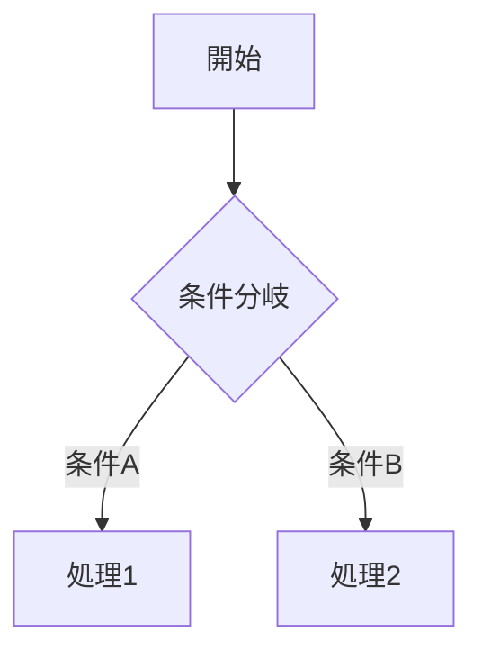

> **禁止**: `scripts/` 配下のスクリプトを修正・上書きしない。問題発見時は完了報告に「要修正: {ファイル名} — {概要}」として記録のみ。
> **禁止**: Claude Code の組み込みmemory機能への書き込みは一切行わない。CLAUDE.md の自動更新は完了後のみ・空欄補完のみ。

## 受け取る情報

- **プロジェクトフォルダのパス**
- **対象コンポーネントAPI名**: 全て or 特定コンポーネントのAPI名リスト（複数可）
- **対象機能グループID**: 全て or 特定のFG-XXX（複数可）。FG-IDで絞り込んだ場合はそのFGに属する全コンポーネントを対象にする
- **読み込ませたい資料のパス**（あれば）

> **絞り込みの優先順位**: FG-IDが指定された場合はそのFGに属するコンポーネントを対象とし、コンポーネントAPI名が指定された場合はそのコンポーネントのみを対象とする。両方「全て」の場合は全量実行。

## 品質原則（最重要・全フェーズ共通）

[共通品質原則参照](.claude/CLAUDE.md#品質原則sf-memory-全カテゴリ共通) — 以下はカテゴリ4固有の追加原則。

1. **網羅的に読む**: force-app/ のソースコードは分割読みで**最後まで**全文読む。サンプリングや「主要なもののみ」で端折らない。大きいファイル（500行超）は200行ずつ分割して全量読む。
2. **具体的に書く**: 「処理を行う」ではなく「Account.Billing_Status__c を"請求済"に更新し、関連するOpportunityLineItemを削除する（DELETE）」。メソッド名・引数・戻り値・SOQL件数・DML件数を必ず記述する。
3. **関連付けを明記する**: 要件番号（FR-XXX）・ユースケースID（UC-XX）・担当オブジェクト・呼び出し元コンポーネントを全て記載する。「どの業務フローのどのステップで動くか」まで記述する。
4. **事実と推定を分ける**: ソースコードに明記されている事項は事実。用途・業務的意味の推測箇所は `**[推定]**` を付ける。不明は `**[要確認]**`。
5. **手動追記を消さない**: 差分更新モードでは既存の設計判断・根拠・注意事項・経緯コメントを絶対に保持する。
6. **未実装を明示する**: ソースが存在しない場合は骨格を生成し全セクションに `**[未実装]**` を付ける。実装済みと未実装を混在させない。

## ファイル読み込み

[共通ルール参照](.claude/CLAUDE.md#ファイル読み込み共通) — 対応形式・sf コマンド代替実行パスは CLAUDE.md の「ファイル読み込み（共通）」セクションを参照。

---

## カテゴリ 4: 設計・機能グループ定義

### 生成フォルダ構成

```
docs/design/
├── apex/        # Apexクラス・トリガー設計書
├── flow/        # フロー設計書
├── batch/       # バッチ・スケジュールジョブ設計書
├── lwc/         # Lightning Web Components 設計書
├── vf/          # Visualforce ページ・コントローラー設計書
├── aura/        # Aura コンポーネント設計書
└── integration/ # 外部連携・Named Credential設計書
```

> **`_index.md` は生成しない**。機能一覧の正本は `機能一覧.xlsx`、機能IDの正本は `docs/.sf/feature_ids.yml`。
> **`config/` は生成しない**。入力規則・権限セット・カスタムメタデータ等の宣言的設定はコードではないため cat4 の対象外。cat3（マスタデータ・自動化設定）の範囲。

### Phase 0: scan_features.py を実行して feature_ids.yml を最新化

カテゴリ4 は **カテゴリ1・2の完了後に実行**される。設計書にIDを付与するため、**最初に必ず** `scan_features.py` を実行して `feature_ids.yml` を最新化する。

```bash
python {project_dir}/scripts/python/sf-doc-mcp/scan_features.py \
  --project-dir "{project_dir}" \
  --output "{project_dir}/docs/.sf/feature_list.json"
```

> `feature_ids.yml` と `feature_list.json` はどちらも `scan_features.py` が自動管理する。手編集禁止。`feature_list.json` は `/sf-design` が参照する永続キャッシュとしてここで生成する（sf-designでの二重実行を防ぐ）。

---

### Phase 0.5: 前段カテゴリの出力を読む（必須）

以下を事前に読み込んでコンテキストを把握する:

```bash
# cat1の生成物を読み込む
# - org-profile.md: 用語集（Glossary）・業種・ビジネス概要（設計書の表記に使う）
# - usecases.md: 各UCで操作されるオブジェクト・フロー（どのUCにコンポーネントを紐付けるか）
# - requirements.md: 機能要件（FR-XXX）とコンポーネントの対応

# cat2の生成物を読み込む
# - docs/catalog/_index.md: 全オブジェクト一覧・用途（担当オブジェクト記載に使う）
# - docs/catalog/custom/ 配下: 各オブジェクトの項目定義・入力規則（データ設計に使う）
```

これらを参照して:
- **用語集（Glossary）の表記に統一**する（cat1 と表記がズレないようにする）
- **各コンポーネントの「どのUCのどのステップで動くか」を特定**する
- **要件番号（FR-XXX）を設計書に付与**する（requirements.md との対応）

次に `docs/design/` 配下にmdファイルが存在するか確認する:
- **存在しない → 初回生成モード**: Phase 1 から全量生成する
- **存在する → アップデートモード**: 手動追記・設計判断の根拠を絶対に消さない。差分のみ更新する

### Phase 1: 対象コンポーネントの収集

**ソースは force-app/ と docs/ の両方を必ず使う。**

```bash
# Apexクラス（テストクラス除外）
sf data query -q "SELECT Name, IsTest FROM ApexClass WHERE NamespacePrefix = null AND IsTest = false ORDER BY Name" --json

# Apexトリガー
sf data query -q "SELECT Name, TableEnumOrId FROM ApexTrigger WHERE NamespacePrefix = null" --json

# フロー（アクティブバージョンのみ）
sf data query -q "SELECT ApiName, ProcessType, Label, Description FROM FlowDefinitionView WHERE ActiveVersionId != null ORDER BY ApiName" --json

# LWCコンポーネント
sf data query -q "SELECT DeveloperName FROM LightningComponentBundle WHERE NamespacePrefix = null ORDER BY DeveloperName" --use-tooling-api --json

# Visualforce ページ
sf data query -q "SELECT Name, ControllerType, ControllerKey FROM ApexPage WHERE NamespacePrefix = null ORDER BY Name" --use-tooling-api --json 2>/dev/null

# Aura コンポーネント
sf data query -q "SELECT DeveloperName FROM AuraDefinitionBundle WHERE NamespacePrefix = null ORDER BY DeveloperName" --use-tooling-api --json 2>/dev/null

# Named Credential（外部連携の存在確認）
sf data query -q "SELECT DeveloperName, Endpoint FROM NamedCredential" --json 2>/dev/null

# バッチ・スケジュール（実装状況確認）
sf data query -q "SELECT Name, JobType, CronExpression FROM CronTrigger WHERE State = 'WAITING' OR State = 'ACQUIRED'" --json 2>/dev/null
```

各コンポーネントのソースファイルを **全文読み込む**（分割読み必須）:
- Apex: `force-app/main/default/classes/{Name}.cls` + `{Name}.cls-meta.xml`
- Flow: `force-app/main/default/flows/{ApiName}.flow-meta.xml`（全ノードを読む）
- LWC: `force-app/main/default/lwc/{name}/{name}.js` + `{name}.html` + `{name}.js-meta.xml`
- VF: `force-app/main/default/pages/{Name}.page` + 対応する `*Controller.cls`
- Aura: `force-app/main/default/aura/{name}/{name}.cmp` + `{name}Controller.js`
- Integration: `force-app/main/default/namedCredentials/` / `externalCredentials/`

既存設計書が存在する場合（アップデートモード）: `docs/design/` 配下の当該ファイルも読み込む。

| 種別 | 出力フォルダ | 判定基準 |
|---|---|---|
| Apexクラス（非バッチ・非スケジュール） | `apex/` | `Database.Batchable` / `Schedulable` 未実装 |
| Apexトリガー | `apex/` | ApexTrigger クエリで検出 |
| フロー | `flow/` | FlowDefinitionView で検出 |
| バッチ・スケジュールジョブ | `batch/` | `Database.Batchable` or `Schedulable` 実装 |
| LWC | `lwc/` | LightningComponentBundle で検出 |
| Visualforce ページ・コントローラー | `vf/` | ApexPage クエリで検出 / `*Controller` クラスで VF 向けと判定 |
| Aura コンポーネント | `aura/` | AuraDefinitionBundle で検出 |
| 外部API・Named Credential連携 | `integration/` | NamedCredential / callout 含む Apex |

> **ハンドラクラスの扱い（重要）**: `xxxHandler.cls` のようなハンドラクラスは、関連するバッチ・トリガーと名前が似ていても**必ず個別に `apex/` へ設計書を作成する**。バッチ/トリガーの設計書に吸収・統合しない。`feature_ids.yml` に CMP-xxx が存在するクラスは全て個別ファイルが必要。

### Phase 1.5: ハッシュチェック（変更なしスキップ）

> **目的**: ソースに変更がないコンポーネントをスキップしてLLM呼び出しを節約する。

各コンポーネントの処理前に以下を実行し、前回実行時からソースが変わっていない場合はスキップする。

```bash
python -c "
import hashlib, json, pathlib, yaml, sys

proj = pathlib.Path(r'{project_dir}')
cache_path = proj / 'docs' / '.sf' / 'cat4_hash_cache.json'
cache = json.loads(cache_path.read_text(encoding='utf-8')) if cache_path.exists() else {}

api_name = '{api_name}'
src_paths = {source_file_paths}  # Phase 1 で特定したソースファイルパスのリスト

h = hashlib.md5()
for p in sorted(src_paths):
    path = pathlib.Path(p)
    if path.exists():
        h.update(path.read_bytes())
current_hash = h.hexdigest()

if cache.get(api_name) == current_hash:
    print('SKIP')
else:
    print(f'UPDATE:{current_hash}')
"
```

- `SKIP` → Phase 2 をスキップして次のコンポーネントへ
- `UPDATE:{hash}` → Phase 2 で設計書を生成/更新し、完了後にキャッシュを更新する

**キャッシュ更新**（Phase 2 完了後）:
```bash
python -c "
import json, pathlib
proj = pathlib.Path(r'{project_dir}')
cache_path = proj / 'docs' / '.sf' / 'cat4_hash_cache.json'
cache = json.loads(cache_path.read_text(encoding='utf-8')) if cache_path.exists() else {}
cache['{api_name}'] = '{new_hash}'
cache_path.write_text(json.dumps(cache, ensure_ascii=False, indent=2), encoding='utf-8')
"
```

---

### Phase 2: 設計書の生成

**ファイル命名規則**: `docs/design/{種別}/【{機能ID}】{コンポーネント名-kebab-case}.md`

機能IDは `docs/.sf/feature_ids.yml` を参照（読み取り専用）。Phase 0 で scan_features.py を実行済みのため、IDは必ず存在する。独自採番・TBD使用禁止。

**ファイル命名の注意（範囲ファイル含む）**: 単一コンポーネントは `【CMP-xxx】name.md`、複数をまとめる場合は `【CMP-xxx〜CMP-xxx等】name.md` とする。**`F-xxx` 表記は使用禁止**。既存の `【F-xxx】` や `【F-xxx〜F-xxx等】` ファイルが存在する場合は `【CMP-xxx】` 形式にリネームしてから内容を更新する。

**既存 【TBD】ファイルの処理**: 設計書を書く前に同名の `【TBD】{コンポーネント名}.md` が存在する場合は削除してから `【CMP-xxx】` ファイルを作成する。

```bash
# 【TBD】ファイルの削除（例: billing-controller.md の場合）
python -c "
import pathlib, glob
design_dir = pathlib.Path(r'{project_dir}/docs/design')
for tbd in design_dir.rglob('【TBD】{kebab_name}.md'):
    tbd.unlink()
    print(f'削除: {tbd}')
"
```

#### 設計書テンプレート（全種別共通・この順序で記述）

```markdown
# 【{機能ID}】{コンポーネント名}（{API名}）

## 基本情報
| 項目 | 値 |
|---|---|
| 機能ID | {feature_ids.ymlの値} |
| 要件番号 | FR-XXX（requirements.md を参照） |
| 実装種別 | Apex / Trigger / Flow / LWC / Aura / Visualforce / Batch / Integration |
| 担当オブジェクト | {主要な操作対象オブジェクト API名} |
| 関連UC | UC-XX: {UC名}（usecases.md を参照） |
| 処理タイミング | {いつ動くか: トリガー起動 / ボタン押下 / スケジュール等} |
| バージョン | {API Version or 作成日} |
| ソースファイル | `force-app/.../{FileName}` |
| 実装状態 | 実装済み / **[未実装]** |

## スコープ・ユーザーストーリー
As a {役割}, I want {目的}, so that {理由}.

（この機能が対応する業務上の問題・背景を記述）

## 実現方式

### 採用方式
（なぜこの実装方式を選んだか。代替案との比較）

| 方式 | 採用 | 理由 |
|---|---|---|
| {採用方式} | ✅ | {理由} |
| {代替案1} | ❌ | {非採用理由} |

### 処理フロー
（複数ステップがある場合は Mermaid flowchart TD で全分岐を図示。単純な1ステップは不要）



## メソッド一覧 / コンポーネント定義
（全量記述。省略不可）

| メソッド名 / プロパティ名 | 種別 | 引数 | 戻り値 | 説明 |
|---|---|---|---|---|

## データ設計

### 入出力
| 項目 | API名 | 型 | 入力/出力 | 説明 |
|---|---|---|---|---|

### SOQLクエリ一覧
（全SOQL。WHERE条件・ORDER BY・LIMITを明記）

| # | FROM句 | WHERE条件 | 目的 |
|---|---|---|---|

### DML操作一覧
| # | 操作 | オブジェクト | 件数目安 | 説明 |
|---|---|---|---|---|

## ロジック設計

### 主要処理の詳細
（分岐条件・計算式・変換ロジックを箇条書きまたは擬似コードで記述）

### 例外・エラー処理
| 例外ケース | 検出方法 | 対処 | ユーザーへの通知 |
|---|---|---|---|

## バリデーション
| 項目 | 条件 | エラーメッセージ |
|---|---|---|

## 権限設計
- 実行コンテキスト: `with sharing` / `without sharing` / System Mode
- 必要な権限: {オブジェクト権限・項目権限・カスタム権限}
- 制限事項: {アクセスできないケース}

## 影響範囲・依存関係
- 呼び出し元: {どのコンポーネント・ページ・フローから呼ばれるか}
- 呼び出し先: {このコンポーネントが呼ぶApex / Flow / 外部API}
- 影響するオブジェクト: {DML対象のオブジェクト一覧}
- 関連コンポーネント: {同一FG内の他コンポーネント}

## テスト観点
（正常系・異常系・境界値ごとにリストアップ）

- [ ] {テストシナリオ1}
- [ ] {テストシナリオ2}

## 未解決事項・要確認
- [ ] **[要確認]** {確認が必要な事項}

## 所見・注意点
（設計上の注意・既知のバグ・パフォーマンス懸念・手動追記歓迎）
```

#### 実装種別ごとの追加指示

**Apex（クラス・トリガー）**:
- 全メソッドをメソッド一覧に記述（private含む）。エントリポイント（`@AuraEnabled` / `@InvocableMethod` / `@future` / トリガーハンドラ呼び出し）は★印で識別
- SOQL件数・DML件数・Callout回数を定量的に記述（例: SOQL 3件・DML 2件・Callout 2回）
- `with sharing` / `without sharing` の選択理由を権限設計に明記
- Trigger の場合: `before/after`・`insert/update/delete` の組み合わせと、各ハンドラメソッドの処理を全量記述
- バルク処理の考慮（ガバナ制限への対応）をテスト観点に必ず含める

**LWC**:
- 全 `@api`・`@track`・`@wire` デコレーター付きプロパティをプロパティ一覧に記述
- 公開メソッド（`@api` メソッド）・発火イベント（`dispatchEvent`）・受信イベント（`addEventListener`）を全量記述
- 「表示場所（ページ / App / Utility Bar等）・利用シナリオ」テーブルを基本情報に含める
- 親子コンポーネント関係を依存関係に明記（どのコンポーネントからこのLWCが使われるか）

**Flow**:
- `flow-meta.xml` を**全文読み込み**、全ノード（Start / Decision / Assignment / RecordCreate / RecordUpdate / ActionCall / SubflowRef等）をMermaid図で**全分岐図示**（省略不可）
  - ただし 1000行超の大規模 Flow は概要（ノード一覧・主要分岐）を先に出力し、詳細は節ごとに分割して読み込む（コンテキスト節約）
- 入力変数・出力変数を全量テーブルで記述（型・必須/任意・初期値）
- Apex呼び出し箇所（`<actionType>APEX</actionType>`）は対象クラス名を明記
- 起動条件（Record-Triggered の場合: オブジェクト・タイミング・条件式）を基本情報に記述

**Batch / Schedule**:
- バッチサイズ（`Database.executeBatch` の scope）・cron式（`System.schedule` の cronExp）を基本情報に記述
- `start` / `execute` / `finish` 各フェーズをそれぞれフロー図で示す
- エラー時の挙動（失敗レコードの扱い・管理者通知）をエラー処理に明記
- 実行環境（本番 / Sandbox の違い・手動実行 vs スケジュール起動）を記述

**Integration（外部連携）**:
- エンドポイントURL・認証方式（Basic / OAuth / APIキー）・リクエスト/レスポンス形式（JSON / SOAP）をデータ設計に記述
- Timeout値・リトライ設定・エラーステータスコードの処理方針を例外処理に記述
- Named Credential名 or カスタム設定からの取得パターンを実現方式に記述
- 外部サービスのサンドボックス/本番切り替え方法を権限設計に記述

### Phase 3: 差分更新 / 変更履歴

差分更新時は手動追記を保持し、更新した設計書のみ記録する。`docs/logs/changelog.md` に追記する。

---

### Phase 4: 機能グループ定義（feature_groups.yml）の生成・更新

設計書の生成（Phase 0〜3）が完了した後に実行する。Phase 2 で生成した設計書の「関連UC」情報を活用してFGを推論する精度が上がるため、設計書生成と同じエージェント実行内で続けて行う。

#### 生成ファイル

`docs/.sf/feature_groups.yml` — UC-anchor方式で全コンポーネントを業務機能グループ（FG）に分類したYAML。sf-design 詳細設計の1ファイル生成単位（1FG = 1詳細設計.xlsx）。

#### スキーマ

```yaml
# docs/.sf/feature_groups.yml
# sf-memoryカテゴリ4が生成。sf-design[詳細設計]の生成単位。
# 手動追記・修正可（次回実行時に保持される）
generated_at: "YYYY-MM-DD"
groups:
  - group_id: "FG-001"
    name_ja: "商談受注後処理"
    name_en: "OpportunityPostProcess"
    description: "受注確定後に請求レコードと納品スケジュールを自動生成する処理群"
    trigger: "Opportunity.StageName が '受注確定' に更新されたとき（トリガー起動）"
    uc_id: "UC-03"
    feature_ids:
      - "CMP-001"
      - "CMP-002"
    components:
      - "OpportunityTrigger"
      - "OpportunityHandler"
      - "BillingCreator"
    related_objects:
      - "Opportunity"
      - "Billing__c"
    related_fgs:
      - "FG-002"
  - group_id: "FG-CMN"
    name_ja: "共通基盤"
    name_en: "Common"
    description: "特定のUCに紐付かない汎用ユーティリティ・バッチ基盤・認証・通知等の処理群"
    trigger: "各UCから呼び出し or スケジュール起動"
    uc_id: null
    feature_ids: []
    components: []
    related_objects: []
```

#### Step 1: コンポーネント一覧の収集

Phase 1 で収集済みのコンポーネント一覧を使用する（再収集不要）。対象が絞り込まれている場合はその対象のみに限定する。

> **FG-IDで絞り込んだ場合**: 既存 feature_groups.yml を読み込み、指定FGに属するコンポーネントのみを対象とする。他FGは変更しない。

#### Step 2: UC-anchor方式でFGを推論

**原則: FGの区切りはUC（業務単位）に固定する。命名パターンで推測しない。**

1. `docs/flow/usecases.md` を全文読み込み、各UCから `uc_id` / `name` / `related_objects` / `trigger` / `actors` を抽出する（FG候補リスト = UCリスト）
   - `usecases.md` が存在しない場合は処理を中断してユーザーに依頼する
2. 各コンポーネントの `operated_objects` を特定する（Phase 2 で生成した設計書の「担当オブジェクト」「関連UC」を最優先で参照）
3. `operated_objects` × UC の `related_objects` を突き合わせてコンポーネントをUCに割り当てる

**割り当てルール（優先順位順）**:

| 優先度 | ルール |
|---|---|
| 1 | 設計書の「関連UC」フィールドが存在する場合はそれを使用 |
| 2 | Triggerの `TableEnumOrId` と UC の `related_objects` が一致 |
| 3 | 全 `operated_objects` が1UCの `related_objects` に含まれる |
| 4 | 最もマッチ数が多いUCを primary、残りは `related_fgs` に |
| 5 | 対応なし → `FG-CMN（共通基盤）`（孤立コンポーネント候補として記録） |

**マージ・分割の判断**:
- 割り当て1件以下のUCが連続かつ同一オブジェクト中心 → 1FGに統合（ただし actor が異なる場合はマージしない）
- 1UCに15件超かつ独立した処理フェーズが明確 → フェーズ単位で分割

**FG-CMN（共通基盤）** は必ず作成し、`group_id: "FG-CMN"` を固定IDとして使用する。全体の30%超が FG-CMN に集まった場合は再調査する。

#### Step 3: YAMLの生成

`docs/.sf/` フォルダが存在しない場合は作成してからYAMLを書き込む。`feature_ids.yml` が存在する場合は必ず読み込み、コンポーネントAPI名を feature_ids の ID に変換してから `feature_ids` フィールドに記載する。

差分更新モードの場合は既存の手動修正（FG名変更・コメント・手動割り当て）を保持したまま、新規コンポーネントのみ追記する。

---

## 最終報告

```
## カテゴリ4 完了

### 生成/更新ファイル（設計書）
- docs/design/apex/: XX件（新規 X件 / 更新 X件）
- docs/design/flow/: XX件
- docs/design/batch/: XX件
- docs/design/lwc/: XX件
- docs/design/integration/: XX件

### 生成/更新ファイル（機能グループ定義）
- docs/.sf/feature_groups.yml（FG XX件、コンポーネント XX件）

### 機能グループ一覧
| group_id | name_ja | uc_id | コンポーネント数 | 備考 |
|---|---|---|---|---|

### 孤立コンポーネント候補（FG-CMN に割り当て）
（どのUCとも対応付けられなかったコンポーネント一覧・用途推定・要確認事項）

### 主な発見・所見
（重要な設計パターン・潜在的なガバナ制限リスク・依存関係の注意点・UC連携の状況等）

### セキュリティ確認
（`without sharing` 使用箇所・外部API認証情報の管理状況）

### 要確認事項（優先度順）
（未実装コンポーネント・用途不明のクラス・要件番号との対応が取れない設計等）

### 成果物再生成推奨（更新があった場合のみ）

【ドキュメント更新推奨】

■ /sf-design / /sf-doc（成果物の再生成）
  □ 機能一覧.xlsx        — 新規コンポーネント追加・削除があった場合
  □ 基本設計.xlsx        — FG構成が変わった場合・仕様変更を伴う場合  対象FG: {FG名}
  □ 詳細設計.xlsx        — 更新コンポーネントが属するFG  対象FG: {FG名}
  □ プログラム設計書.xlsx  — 更新したコンポーネント  対象: {コンポーネント名}

※ cat2（オブジェクト変更）も同時に行った場合はオブジェクト定義書.xlsx の再生成も推奨
```
