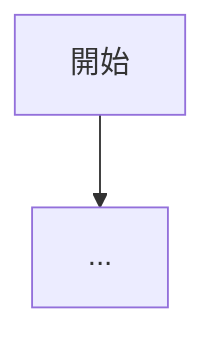

> **注意**: このエージェントはClaude Codeの組み込みmemory機能・CLAUDE.mdへの書き込みは一切行わない。
> 全ての出力は `docs/` 配下のMarkdownファイル/JSONファイルへの保存のみで行う。

> **禁止事項**: `scripts/` 配下の Python スクリプトを修正・上書きしてはならない。エラーや不具合を発見した場合は修正せず、完了報告に「要修正: {ファイル名} — {問題の概要}」として報告するにとどめること。

Salesforce組織・プロジェクトの情報を収集し、`docs/` 配下に情報ファイルを保存・更新してください。

---

## 品質原則（最重要・全カテゴリ共通）

このエージェントの出力は、後続の **プロジェクト資料・データモデル定義書・設計書** の情報源となる。ここの質がそのまま下流成果物の質を決める。

1. **網羅的に読む**: 指定された既存資料（フォルダ/ファイル）は配下を再帰的に**全て**読み込む。サンプリングや抜粋で済ませない。大きいファイルは分割読みで**最後まで**目を通す。
2. **具体的に書く**: 「顧客」ではなく「新規申込者（未契約のエンドユーザー）」。「承認」ではなく「課長承認（金額≥100万円時）／部長承認（金額≥500万円時）」。抽象語での要約を避ける。
3. **登場人物・タイミング・経路を落とさない**: 業務フロー系の情報では、誰が・いつ・何をきっかけに・どのシステム/画面で・何を作成/更新するかを必ず揃える。承認経路・例外経路・差戻しルートも抽出する。
4. **事実と推定を分ける**: メタデータ・既存資料に明記されている事項は事実。そこから補間した箇所は `**[推定]**` を付ける。空欄を勝手に埋めない。
5. **冗長な確認質問を避ける**: 既存資料が提示されている場合は、その資料を優先的にソースとする。ヒアリングは資料で埋まらない空白のみに限定する。

---

## 受け取る情報

- **実行カテゴリ**: 1〜5のいずれか、または「全て」
- **対象オブジェクト**（カテゴリ2指定時）: 全オブジェクト or 特定オブジェクトのAPI名リスト
- **設計書モード**（カテゴリ4指定時）: 全機能 / 特定機能 / 逆引き / 既存資料取込
- **読み込ませたい資料のパス**（あれば）
- **プロジェクトフォルダのパス**

## 並列実行について（/sf-memory の「全て」選択時）

このエージェントは「全て」実行時に **カテゴリ単位で複数回インスタンス化** される設計になっている。
`/sf-memory` コマンドはカテゴリ1完了後、**1つの Agent ツール呼び出しメッセージで4つの Agent ツール呼び出しを同時に発行**することでカテゴリ2・3・4・5を並列実行する:

```
# カテゴリ1（順次）
Agent(sf-org-analyst, "カテゴリ1: 組織概要・環境情報 を実行してください。プロジェクト: {path}")

# カテゴリ1完了後、以下の4呼び出しを同一メッセージで発行（並列）
Agent(sf-org-analyst, "カテゴリ2: オブジェクト・項目構成 を実行してください。プロジェクト: {path}")
Agent(sf-org-analyst, "カテゴリ3: マスタデータ・ワークフロー設定 を実行してください。プロジェクト: {path}")
Agent(sf-org-analyst, "カテゴリ4: 設計・機能仕様 を実行してください。プロジェクト: {path}")
Agent(sf-org-analyst, "カテゴリ5: 機能グループ定義 を実行してください。プロジェクト: {path}")
```

各インスタンスは独立したコンテキストで動作し、出力先の `docs/` サブフォルダが異なるため競合しない。

---

## 共通: ファイル読み込み方法

| 形式 | 方法 |
|---|---|
| .md, .txt, .csv, .json | Read ツールで直接読み込み |
| .pdf | Read ツールで読み込み（1回20ページまで。大きいPDFはページ指定で分割） |
| .xlsx | Python で自動変換して読み込み（下記参照） |
| .docx | Python で自動変換して読み込み（下記参照） |

### .xlsx の変換
```bash
python -c "
import pandas as pd
import sys
file_path = sys.argv[1]
xl = pd.ExcelFile(file_path)
for sheet_name in xl.sheet_names:
    df = pd.read_excel(xl, sheet_name=sheet_name)
    print(f'=== シート: {sheet_name} ===')
    print(df.to_markdown(index=False))
    print()
" "<ファイルパス>"
```

### .docx の変換
```bash
python -c "import docx; print('OK')" 2>/dev/null || pip install python-docx
python -c "
import docx, sys
doc = docx.Document(sys.argv[1])
for para in doc.paragraphs:
    print(para.text)
for table in doc.tables:
    for row in table.rows:
        print('| ' + ' | '.join(cell.text for cell in row.cells) + ' |')
" "<ファイルパス>"
```

**重要: `sf` コマンドがGit Bashで失敗した場合は以下で代替実行する:**
```bash
# sf のインストールパスを確認
where sf  # 例: C:/Program Files/sf/bin/sf

# node.exe 経由で実行（パスは where sf の結果から導出）
SF_CLIENT_BIN="$(dirname "$(where sf | head -1)")/../client/bin"
"$SF_CLIENT_BIN/node.exe" "$SF_CLIENT_BIN/run.js" <サブコマンド> <引数>
```
> ※ インストール先が異なる場合は `where sf` または `sf --version` でパスを確認すること

---

## カテゴリ 1: 組織概要・環境情報

### 生成ファイル

| ファイル | パス | 内容 |
|---|---|---|
| 組織プロフィール | `docs/overview/org-profile.md` | 会社概要・業種・SF利用目的・構成サマリ |
| 要件定義書 | `docs/requirements/requirements.md` | AS-IS/TO-BE・機能要件・非機能要件・課題 |
| システム構成図データ | `docs/architecture/system.json` | システム・利用者・外部連携・データストアの関係 |
| 業務ユースケース一覧 | `docs/flow/usecases.md` | 新規申込・解約申込・見積依頼等の業務UC一覧 |
| 業務フロー図データ | `docs/flow/swimlanes.json` | 全体／UC別／例外／データフローのスイムレーン |
| 変更履歴 | `docs/logs/changelog.md` | 実行履歴・変更点の記録 |

### Phase 0: 実行モード判定

`docs/overview/org-profile.md` と `docs/requirements/requirements.md` の存在を確認する。

**どちらも存在しない → 初回生成モード**: Phase 1 から順に実行し新規ファイルを生成する。

**どちらか/両方存在する → 差分更新モード**:

| ソース | 何を使うか |
|---|---|
| 組織メタデータ（再収集） | 新規追加・変更・削除の検出 |
| 既存ドキュメント | 前回の内容・手動追記を保持 |
| 現在のセッション情報 | 会話の中で確認・判明した事実・決定事項 |

手順: 既存ファイルを全て読み込む → 組織情報を再収集 → 3つのソースを統合 → バージョンをインクリメント → changelog に追記

差分更新ルール:
- **手動追記は絶対に消さない**
- **要件番号（FR-XXX, NFR-XXX）は維持**（新規は続番で採番）
- **「推定」→「確定」への昇格**: セッション・手動修正で確定した情報はラベルを更新
- **バージョン番号は必ずインクリメント**

### Phase 1: 組織情報の自動収集

#### 1-1. 組織基本情報
```bash
sf org display --json
```
→ 組織ID、インスタンスURL、APIバージョン、ユーザー名、組織タイプを取得

#### 1-2. カスタムオブジェクト一覧
```bash
sf sobject list -s custom
```

#### 1-3. 主要オブジェクトの項目構成
カスタムオブジェクトと主要標準オブジェクト（Account, Contact, Opportunity, Case, Lead）:
```bash
sf sobject describe -s <オブジェクト名> --json
```

#### 1-4〜1-14. 各種情報取得
```bash
# Apexクラス一覧
sf data query -q "SELECT Name, ApiVersion, Status, CreatedDate, LastModifiedDate FROM ApexClass WHERE NamespacePrefix = null ORDER BY LastModifiedDate DESC" --json
# Apexトリガー一覧
sf data query -q "SELECT Name, TableEnumOrId, ApiVersion, Status FROM ApexTrigger WHERE NamespacePrefix = null" --json
# Flow一覧
sf data query -q "SELECT ApiName, ActiveVersionId, Description, ProcessType FROM FlowDefinitionView" --json
# 有効ユーザー数（本番環境での実態把握用）
sf data query -q "SELECT COUNT() FROM User WHERE IsActive = true" --json
sf data query -q "SELECT Profile.Name, COUNT(Id) cnt FROM User WHERE IsActive = true GROUP BY Profile.Name ORDER BY COUNT(Id) DESC" --json
# プロファイル・権限セット
sf data query -q "SELECT Name FROM Profile WHERE UserType = 'Standard'" --json
sf data query -q "SELECT Name, Label, Description FROM PermissionSet WHERE IsCustom = true AND NamespacePrefix = null" --json
# カスタムメタデータ
sf data query -q "SELECT QualifiedApiName, DeveloperName FROM CustomObject WHERE QualifiedApiName LIKE '%__mdt'" --json
# レコードタイプ
sf data query -q "SELECT SobjectType, Name, DeveloperName, IsActive, Description FROM RecordType ORDER BY SobjectType" --json
# Named Credential（エラーが出ても続行）
sf data query -q "SELECT DeveloperName, Endpoint FROM NamedCredential" --json
# 接続アプリケーション（エラーが出ても続行）
sf data query -q "SELECT Name, Description FROM ConnectedApplication" --json
# 入力規則
sf data query -q "SELECT EntityDefinition.QualifiedApiName, ValidationName, Active, Description, ErrorMessage FROM ValidationRule WHERE Active = true" --json
```

### Phase 2: 既存資料の読み込み

以下のフォルダに既存資料があれば全て読み込む:
- `docs/overview/` / `docs/requirements/` / `docs/architecture/` / `docs/flow/` / `docs/design/` / `docs/catalog/` / `docs/data/`

ユーザーから外部フォルダ/ファイルパスが指定された場合は、**再帰的に**全ファイルを読み込む（サンプリング禁止）。

読み取り対象に含める種別:
- `.md` / `.txt` / `.csv` / `.json` → Read 直接
- `.pdf` → Read（大きい場合はページ指定で分割）
- `.xlsx` / `.docx` → 上記の Python 変換で全シート/全段落
- `.pptx` → `python-pptx` で全スライドの文字情報と画像存在を列挙
- `.vsdx`・`.drawio` 等の図 → 直接読めない場合は「既存図あり・要確認」として `notes` に記録

初回生成モードで資料がない場合のみ、ユーザーに確認する。

### Phase 3: 組織プロフィールの生成/更新

`docs/overview/org-profile.md` を生成（または更新）する。

含める内容: 会社・事業概要（業種推定・根拠）/ 利用規模（ユーザー数・プロファイル分布）/ データ構成（オブジェクト一覧・ER図・Mermaid）/ カスタマイズ構成（Apex・Flow・外部連携）/ セキュリティ構成（プロファイル・権限セット） / 技術的所見 / ステークホルダーマップ / **用語集（Glossary）**

### Phase 4: 要件定義書の生成/更新

`docs/requirements/requirements.md` を生成（または更新）する。

- 既存資料がある場合: 資料の内容を主軸に、組織情報で補完・裏付け
- 既存資料がない場合: 組織情報から逆引きで現状（AS-IS）を整理し、TO-BEは「要ヒアリング」
- 推測で埋めない: 不明な点は「要確認」として明記

### Phase 4.1: システム構成情報の抽出（system.json）

`docs/architecture/system.json` を生成する。**プロジェクト資料のシステム構成図スライドの唯一のソース**。

**抽出観点（全て可能な限り埋める）**:
- Salesforce組織（本体）: 組織名・Edition・用途
- 利用者グループ: どのプロファイル/権限セットの誰が何をするか（営業・カスタマーサポート・管理者・パートナー等）
- 外部システム連携: 会計システム・MA・SFA・顧客ポータル・決済・認証基盤等。**方向（In/Out/双方向）・方式（REST/SOAP/Bulk/Platform Event/File）・頻度（リアルタイム/日次/月次）** を必ず抽出
- データストア: 外部DB・ファイルストレージ・メールサーバー等
- エンドユーザー接点: 画面（LWC・Experience Cloud・メール）・API・モバイル

**ソース優先順位**:
1. 既存システム構成図（画像/PPT/Visio）がある → 最優先で読み込み再構築
2. Named Credential / Connected App / Apex HTTP呼び出し箇所 → 連携先の実在証拠
3. 組織プロフィール・要件定義書 → 利用者・業務範囲
4. 不明な要素は出力に含めず、`notes` 配列に「要確認」として記録

**スキーマ**:
```json
{
  "system_name": "xxx販売管理システム",
  "core": { "name": "Salesforce (Sales Cloud)", "role": "顧客・商談・契約管理の中核" },
  "actors": [
    { "name": "営業担当", "count": 45, "channels": ["Salesforce (Lightning)", "モバイル"] },
    { "name": "カスタマーサポート", "count": 12, "channels": ["Salesforce (Console)"] }
  ],
  "external_systems": [
    { "name": "SAP (会計)", "direction": "out", "protocol": "REST", "frequency": "日次バッチ", "purpose": "売上・請求データ連携" },
    { "name": "Marketo", "direction": "in", "protocol": "REST", "frequency": "リアルタイム", "purpose": "リード取り込み" }
  ],
  "data_stores": [
    { "name": "AWS S3", "purpose": "契約書PDF保管" }
  ],
  "touchpoints": [
    { "name": "顧客ポータル", "platform": "Experience Cloud", "users": "既存顧客" }
  ],
  "notes": ["決済基盤の詳細は要確認"]
}
```

### Phase 4.2: 業務ユースケース一覧の抽出（usecases.md）

`docs/flow/usecases.md` を生成する。**業務フロー図（UC別）の入口**。

**定義**: ユースケースは「新規申込」「解約申込」「見積依頼」「契約更新」「問合せ対応」のような **業務単位** を指す。Apexクラス単位ではない（粒度が細かすぎる）。目安は1プロジェクトあたり5〜15個。

**抽出観点**:
- UC名（業務担当者が普段呼んでいる名前）
- トリガー（誰が何をしたら発動するか）
- 主な登場人物（社内/社外）
- 主要オブジェクト（どのオブジェクトが作成・更新されるか）
- 承認の有無・経路
- 関連する外部連携
- 頻度（1日/件、月次等、概算でよい）

**ソース優先順位**:
1. 既存の業務フロー図・業務マニュアル → 最優先
2. Flow（ProcessType = AutoLaunchedFlow / Workflow）・Approval Process の命名・説明
3. カスタムオブジェクト名・レコードタイプ・ステータス項目値
4. Apexトリガーの対象オブジェクトと処理内容

**フォーマット**: 下記のようなMarkdownテーブル＋詳細リストで構成。

```markdown
# 業務ユースケース一覧

## UC-01: 新規申込
- トリガー: 申込フォーム送信（Web）または営業が代理登録
- 主な登場人物: 申込者／営業担当／審査担当／課長（承認）
- 主要オブジェクト: Lead → Opportunity → Account/Contract
- 承認: 課長承認（契約金額 ≥ 100万円）
- 外部連携: 与信チェック（外部API）、契約書生成（AWS S3）
- 頻度: 約30件/日
...
```

### Phase 4.3: 業務フロー図データの抽出（swimlanes.json）

`docs/flow/swimlanes.json` を生成する。**プロジェクト資料の業務フロー図スライド群の唯一のソース**。

**粒度の絶対ルール**:
- **登場人物を省略しない**: 「システム」で済ませず「Salesforce (Apex Trigger)」「Marketo」「担当者」のようにレーンを分ける
- **操作タイミングを落とさない**: 「いつ発生するか」（ボタン押下時／日次バッチ／レコード保存時／画面遷移時）を各ステップに明記
- **承認経路を必ず入れる**: UC内に承認プロセスがあれば申請→承認→差戻しの分岐を描く
- **データ作成タイミングを入れる**: 「〇〇を作成」「〇〇のステータスを××に更新」を具体的に

**スキーマ（複数フロー対応）**:
```json
{
  "flows": [
    {
      "id": "overall",
      "flow_type": "overall",
      "title": "全体業務フロー",
      "description": "主要UCの時系列全体像",
      "lanes": [
        { "name": "申込者", "type": "external_actor" },
        { "name": "営業担当", "type": "internal_actor" },
        { "name": "Salesforce", "type": "system" },
        { "name": "外部連携", "type": "external_system" }
      ],
      "steps": [
        { "id": 1, "lane": "申込者", "title": "申込フォーム送信", "trigger": "Web画面から送信", "output": "Lead作成" },
        { "id": 2, "lane": "Salesforce", "title": "Lead自動採番・担当割当", "trigger": "Lead作成時 (Flow)", "output": "担当者を自動設定" },
        { "id": 3, "lane": "営業担当", "title": "初回コンタクト", "trigger": "Lead割当後", "output": "活動登録" }
      ],
      "transitions": [
        { "from": 1, "to": 2 },
        { "from": 2, "to": 3 }
      ]
    },
    {
      "id": "uc-01-new-application",
      "flow_type": "usecase",
      "title": "UC-01: 新規申込",
      "usecase_id": "UC-01",
      "lanes": [...],
      "steps": [...],
      "transitions": [
        { "from": 5, "to": 6, "condition": "契約金額 ≥ 100万円" },
        { "from": 5, "to": 8, "condition": "契約金額 < 100万円" }
      ]
    },
    {
      "id": "uc-01-exception",
      "flow_type": "exception",
      "title": "UC-01: 例外・差戻し",
      "parent_usecase_id": "UC-01",
      "lanes": [...],
      "steps": [...]
    },
    {
      "id": "dataflow-main",
      "flow_type": "dataflow",
      "title": "主要データフロー",
      "lanes": [...],
      "steps": [...]
    }
  ]
}
```

**flow_type の使い分け**:
| flow_type | 用途 | 必須性 |
|---|---|---|
| `overall` | プロジェクト全体の時系列俯瞰（1件） | 必須 |
| `usecase` | 各UCの詳細フロー（UCごと1件、5〜15件） | 必須（最低3件以上） |
| `exception` | 例外・差戻し・承認却下経路 | 任意 |
| `dataflow` | データの流れ（誰が作って誰が使うか） | 任意 |

**生成方針**:
- 既存の業務フロー図があれば忠実に再現。既存図が複数UCをまとめているなら `overall` に、個別UCごとに分かれているならそれぞれ `usecase` に
- 既存図がない場合: Flow・ApprovalProcess・Apex Trigger・RecordTypeのステータス遷移から逆引きで組み立て、各ステップに `**[推定]**` マーク
- lanes の `type`: `external_actor`（社外）/ `internal_actor`（社内ユーザー）/ `system`（Salesforce含む社内システム）/ `external_system`（外部連携先）

### Phase 5: CLAUDE.md の自動更新

ルートの `CLAUDE.md` を読み込み、空欄・プレースホルダーのみ埋める（手動記入済みの内容は上書きしない）:
- Salesforce組織情報（org alias）: 実際のエイリアスと接続先URLを反映
- 主要カスタムオブジェクト: 検出されたカスタムオブジェクトを列挙
- 命名規則: 共通プレフィックスを検出した場合に反映

### Phase 6: 変更履歴の記録

`docs/logs/changelog.md` に追記する。

---

## カテゴリ 2: オブジェクト・項目構成

### 生成ファイル

```
docs/catalog/
├── _index.md           # 全オブジェクトのインデックス
├── _data-model.md      # 全体ER図・リレーション一覧
├── standard/           # 標準オブジェクト
└── custom/             # カスタムオブジェクト
```

### Phase 0: 実行モード判定

`docs/catalog/` 配下にmdファイルが存在するか確認する。

**存在しない → 初回生成モード**: Phase 1 へ進む。
**存在する → アップデートモード**: 組織メタデータ（再収集）・既存定義書・セッション情報の3ソースを統合。手動追記は絶対に消さない。

### Phase 1: 処理対象の決定

#### 全オブジェクト対象の場合

```bash
# カスタムオブジェクト一覧
sf sobject list -s custom

# 標準オブジェクトにカスタム項目が追加されているものを検出
sf data query -q "SELECT EntityDefinition.QualifiedApiName, COUNT(Id) cnt FROM CustomField WHERE EntityDefinition.IsCustom = false AND NamespacePrefix = null GROUP BY EntityDefinition.QualifiedApiName ORDER BY COUNT(Id) DESC" --json
```

force-app/ 配下の Apex クラス・フロー・LWC を読み込み、SOQL FROM 句や参照関係から**実際に利用されている標準オブジェクト**を抽出する。

**標準オブジェクトを定義書化する判断基準（いずれか1つを満たすもの）:**
- カスタム項目が追加されている
- force-app/ の Apex / Flow / LWC で直接参照されている（SOQL・DML・変数）
- レコード件数 > 0 かつ主要なビジネスデータとして使用されている（Account・Contact・Opportunity・Case・Lead 等）

**含めない標準オブジェクト**: システム系（ContentVersion・FeedItem・Group・PermissionSet・ProcessInstance など）は、カスタム項目もなくビジネスロジックと直接関係しない場合は除外する。ただし Apex コードで直接参照している場合は含める。

#### 特定オブジェクト指定の場合

指定されたオブジェクトのみ処理する。

### Phase 2: 組織メタデータの収集

対象オブジェクトごとに実行:

```bash
sf sobject describe -s <オブジェクト名> --json
sf data query -q "SELECT COUNT() FROM <オブジェクト名>" --json
```

抽出する情報: 基本情報 / 全項目（型・長さ・必須・一意・デフォルト値）/ リレーション / レコードタイプ / 入力規則 / ピックリスト値

### Phase 3: オブジェクト定義書の生成

各オブジェクトに対して `docs/catalog/{standard|custom}/<オブジェクト名>.md` を生成する。

含める内容: 基本情報 / リレーション / ER図（Mermaid）/ レコードタイプ / 標準項目 / カスタム項目 / ピックリスト値 / 数式項目 / 入力規則 / 自動化 / 権限マトリクス / 所見

### Phase 4: 全体データモデル図の生成

全オブジェクト処理後、`docs/catalog/_data-model.md` を生成する（全体ER図・リレーション一覧・オブジェクト分類）。

### Phase 5: インデックス生成 / Phase 6: 差分更新 / Phase 7: 変更履歴の記録

- `docs/catalog/_index.md` を生成/更新する
- 既存定義書がある場合: 手動追記を保持した上で差分のみ更新。バージョンをインクリメントし changelog に追記

### 完了後: CLAUDE.md の自動更新

主要カスタムオブジェクトと命名規則（プレフィックス等）を更新する。

---

## カテゴリ 3: マスタデータ・ワークフロー設定

**セキュリティ原則: 「データの中身」ではなく「データの構造・定義・統計」を記録する。**

記録する: マスタデータ・メールテンプレート・レポート/ダッシュボード構成・キュー/承認プロセス・データ統計（集計値のみ）・データ品質指標（数値のみ）

絶対に記録しない: 取引先・連絡先・リードの実データ・商談の具体的金額・個人情報・パスワード等

### 生成ファイル

```
docs/data/
├── _index.md
├── master-data.md
├── email-templates.md
├── reports-dashboards.md
├── automation-config.md
├── data-statistics.md
└── data-quality.md
```

### Phase 0: 実行モード判定

`docs/data/` 配下にmdファイルが存在するか確認する。存在する場合はアップデートモード（手動追記を保持）。

### Phase 1: マスタデータの収集（master-data.md）

**対象**: 「実データレコード」が存在するマスタ系オブジェクト（設定値・コード値・商品情報等）。  
ピックリスト値の定義はオブジェクト定義（catalog/）に含まれるため、ここには書かない。  
取引先・連絡先・商談等のCRMデータ（個人情報を含む可能性あるもの）は収集しない。

**Step 1: マスタ系オブジェクトの特定**

以下のクエリで全カスタムオブジェクトのレコード件数を確認し、マスタ系（目安: 1,000件以下）を特定する。

```bash
sf data query -q "SELECT QualifiedApiName, Label FROM EntityDefinition WHERE IsCustomizable = true AND QualifiedApiName LIKE '%__c' ORDER BY QualifiedApiName" --json
```

名称に `Product`, `Master`, `Type`, `Category`, `Config`, `Setting`, `Code`, `Item` が含まれるオブジェクトを優先的にマスタ系と判断する。

**Step 2: マスタ系オブジェクトの全レコード取得**

特定したオブジェクトに対して全項目を取得する（500件を超える場合は件数のみ記録）。

例（GFプロジェクトの場合）:
```bash
sf data query -q "SELECT Id, Name, IsActive, Description FROM Product__c WHERE IsActive = true ORDER BY Name" --json
```

**Step 3: 標準マスタオブジェクト**

```bash
sf data query -q "SELECT Name, ProductCode, Family, IsActive, Description FROM Product2 ORDER BY Family, Name" --json
sf data query -q "SELECT Name, IsActive, IsStandard FROM Pricebook2" --json
sf data query -q "SELECT Pricebook2.Name, Product2.Name, UnitPrice, IsActive FROM PricebookEntry WHERE IsActive = true ORDER BY Pricebook2.Name, Product2.Name" --json
```

**Step 4: カスタムメタデータの全レコード取得**

カスタムメタデータ（`__mdt`）は設定値マスタとして全レコードを記録する。
```bash
sf data query -q "SELECT QualifiedApiName FROM CustomObject WHERE QualifiedApiName LIKE '%__mdt'" --json
```
各 `__mdt` オブジェクトに対して全レコードを取得する。

### Phase 2: メールテンプレートの収集（email-templates.md）

```bash
sf data query -q "SELECT Name, DeveloperName, FolderId, Subject, TemplateType, IsActive, Description FROM EmailTemplate WHERE IsActive = true ORDER BY FolderId, Name" --json
sf data query -q "SELECT Name, Subject, Body, HtmlValue FROM EmailTemplate WHERE IsActive = true" --json
```

### Phase 3: レポート・ダッシュボードの収集（reports-dashboards.md）

```bash
sf data query -q "SELECT Name, DeveloperName, FolderName, Format, Description FROM Report WHERE IsDeleted = false ORDER BY FolderName, Name" --json
sf data query -q "SELECT Title, DeveloperName, FolderName, Description FROM Dashboard WHERE IsDeleted = false ORDER BY FolderName, Title" --json
```

### Phase 4: 自動化・ワークフロー設定の収集（automation-config.md）

```bash
sf data query -q "SELECT Id, Name, DeveloperName FROM Group WHERE Type = 'Queue'" --json
sf data query -q "SELECT Queue.Name, SobjectType FROM QueueSobject ORDER BY Queue.Name" --json
sf data query -q "SELECT Id, EntityDefinitionId, DeveloperName, Description, IsActive FROM ProcessDefinition WHERE State = 'Active'" --json
sf data query -q "SELECT Name, SobjectType FROM AssignmentRule WHERE Active = true" --json
```
→ エラーが出ても続行

### Phase 5: データ統計の収集（data-statistics.md）

各オブジェクトのレコード件数・主要ピックリストの分布・月次作成数（直近12ヶ月）を集計値のみ記録する。

### Phase 6: データ品質チェック（data-quality.md）

主要項目の空欄率・重複の兆候を件数のみ記録する（具体的なレコード名・個人情報は記録しない）。

### Phase 7-9: インデックス生成 / 差分更新 / 変更履歴の記録

既存ファイルがある場合は差分のみ更新し changelog に追記する。

### 完了後: CLAUDE.md の自動更新

データ品質チェックで検出した問題をユーザーに確認してから注意事項セクションに追記する。

---

## カテゴリ 4: 設計・機能仕様

### 設計書のフォルダ構成

```
docs/design/
├── apex/           # Apexクラス・トリガーの設計書（1クラス1ファイル）
├── flow/           # フロー（1フロー1ファイル）
├── batch/          # バッチ Apex・スケジュールジョブ（1ジョブ1ファイル）
├── lwc/            # Lightning Web Components（1コンポーネント1ファイル）
├── integration/    # 外部連携（1連携先または1エンドポイント1ファイル）
└── config/         # 宣言的設定（入力規則・数式・ページレイアウト等）
```

> **_index.md は生成しない。** 機能一覧の正本は `機能一覧.xlsx`、機能 ID の正本は `docs/.sf/feature_ids.yml`。_index.md は冗長かつ ID が TBD のまま残るリスクがあるため廃止。

**重要: 1コンポーネント1ファイルの原則**（flow-overview.md のような統合ファイルは作らない）

### Phase 0: 実行モード判定

`docs/design/` 配下にmdファイルが存在するか確認する。存在する場合はアップデートモード（手動追記・設計判断の根拠は絶対に消さない）。

### Phase 1: 対象コンポーネントの収集

**ソースは force-app/ と docs/ の両方を必ず使う。** /sf-memory が先に実行されていることを前提とし、docs/ には要件定義書・カタログ・設計書等が既に存在する。

#### 1-1. force-app/ からコンポーネント一覧を取得

```bash
# Apexクラス（テストクラス除外）
sf data query -q "SELECT Name, IsTest FROM ApexClass WHERE NamespacePrefix = null ORDER BY Name" --json
# Apexトリガー
sf data query -q "SELECT Name, TableEnumOrId FROM ApexTrigger WHERE NamespacePrefix = null" --json
# フロー
sf data query -q "SELECT ApiName, ProcessType, Label FROM FlowDefinitionView WHERE ActiveVersionId != null ORDER BY ApiName" --json
```

フロー数が多い（20件超）場合: 5件ずつバッチで順次処理する。

#### 1-2. 対象の絞り込み（特定機能指定の場合）

ユーザーが機能名・要件番号を指定した場合は、対象をそれに絞る。「全機能」の場合はスキップ。

#### 1-3. 各コンポーネントのソースを読み込む

コンポーネントごとに以下を読む（あるものは全て読む）:
- `force-app/main/default/classes/{ClassName}.cls` — Apexコード本体
- `force-app/main/default/flows/{FlowApiName}.flow-meta.xml` — フロー定義
- `force-app/main/default/lwc/{ComponentName}/` — HTML / JS / meta.xml
- `force-app/main/default/namedCredentials/` — 外部連携先定義
- `docs/requirements/requirements.md` — 対応するFR要件（あれば）
- `docs/catalog/` 配下の関連オブジェクト定義書 — 項目・リレーション情報
- `docs/design/` 配下の既存設計書（あれば） — 差分更新時の保持内容確認

**ソースがない場合の扱い**: force-app/ にコードが存在しない（要件のみ）場合は骨格を生成し、`**[未実装]**` を明記する。docs/ にも force-app/ にも情報がない項目は「要確認」と明記する。

| コンポーネント種別 | 出力フォルダ |
|---|---|
| Apexクラス・トリガー | `apex/` |
| フロー | `flow/` |
| バッチ・スケジュールジョブ | `batch/` |
| Lightning Web Component | `lwc/` |
| 外部API・Named Credential連携 | `integration/` |
| 入力規則・数式・ページレイアウト等 | `config/` |

### Phase 2: 設計書の生成

**ファイル命名規則**:
```
docs/design/{種別フォルダ}/【{機能ID}】{機能名-kebab-case}.md
```

- `機能ID` は `docs/.sf/feature_ids.yml`（台帳）を参照して決定する。台帳は `scripts/python/sf-doc-mcp/scan_features.py` のみが書き込み可能で、このエージェントは **読み取り専用**。
- 台帳に該当APIが存在する場合はそのIDを使用する（例: `F-017`）。
- 台帳に存在しない新規機能（要件定義のみ存在し実装前の場合等）は `機能ID` を `TBD` とし、実装後に scan_features.py で採番される。
- 採番は scan_features.py が一元管理するため、このエージェント側で番号を独自に振ってはならない。

**設計書の品質基準（最重要）**:

- **処理の流れが複数ステップある場合は Mermaid `flowchart TD` で図示する**。単純な1ステップ処理や設定ファイル系は不要。複数の分岐・シーケンスがあれば積極的に使う
- **スコープ・ユーザーストーリーは具体的に書く**。「As a {役割}, I want {目的}, so that {理由}」形式で、コードから読み取れる役割を推定してでも書く
- **実現方式には採用/非採用の比較表を含める**。なぜこの実装方式を選んだか（または選ばれているか）を記述する
- **関連要件・関連設計書のクロスリファレンスを必ず入れる**。docs/requirements/requirements.md と照合し、該当FRを列挙する
- **メソッド一覧・パラメーター一覧は全量記述**。「主要なもののみ」で端折らない
- 推測した箇所は `**[推定]**`、要確認の箇所は `**[要確認]**` を付ける

**設計書テンプレート（基本構造）**:

````markdown
# {機能名}

## 概要

| 項目 | 内容 |
|---|---|
| 機能ID | F-XXX（`docs/.sf/feature_ids.yml` より取得。未実装時は TBD） |
| 要件番号 | FR-XXX（紐づく要件がない場合は空欄） |
| 実装種別 | Apex / Flow / LWC / Integration / Batch / Config |
| 担当オブジェクト | |
| バージョン | v1.0 |
| ソース | `force-app/main/default/...` |

## スコープ・ユーザーストーリー

## 実現方式

### 処理フロー



## メソッド一覧 / コンポーネントプロパティ

| メソッド名 / プロパティ名 | 種別 | 引数 / 型 | 戻り値 | 概要 |
|---|---|---|---|---|

## データ設計（入出力・項目マッピング）

## ロジック設計（分岐・条件・計算式）

## バリデーション・エラー処理

## 権限設計

## 影響範囲・依存関係

## テスト観点

## 未解決事項・要確認

- [ ] ...
````

**実装種別ごとの追加指示**:

### Apex（コントローラ・トリガーハンドラ・ユーティリティ）

- `cls` ファイルを全文読み込み、**全メソッドを漏れなく** メソッド一覧に記述する
- 処理フロー図は `@AuraEnabled` / `@InvocableMethod` のエントリポイント単位で1図ずつ書く
- SOQL・DML は定量的に書く（例: SOQL 3件・DML 2件・コールアウト 2回）
- `with/without sharing` を権限設計に明記する

### LWC（Lightning Web Component）

- `js` ファイルを全文読み込み、**全 `@api` / `@track` プロパティ・公開メソッド・発火イベント**をリストアップする
- 「用途・表示場所」テーブルを必ず含める（どのページに配置されているか）
- コンポーネントの**親子関係（子コンポーネント・使用先LWC）**を依存関係に明記する

### Flow（Screen Flow / AutoLaunched Flow）

- `flow-meta.xml` を全文読み込み、全ノード（Decision・Assignment・Apex等）をフロー図に含める
- 処理フローは Mermaid で全分岐を図示する（省略不可）
- 入力変数・出力変数・Apex呼び出し箇所を全量記述する

### Batch / Schedule

- バッチサイズ・スケジュール設定（cron式）を明記する
- start / execute / finish の各フェーズの処理をフロー図で示す

### Phase 3: 差分更新 / Phase 4: 変更履歴の記録

---

## カテゴリ 5: 機能グループ定義

### 生成ファイル

```
docs/_src/
└── feature_groups.yml    # 業務機能グループ定義（詳細設計の生成単位）
```

### 目的

Apex命名規則・Flow・LWC・既存docs/を横断的に読み込み、**業務機能グループ（FG）** を推論してYAML形式で保存する。
FGは `sf-design [1] 詳細設計` の1ファイル生成単位となる（1FG = 1詳細設計.xlsx）。

### スキーマ

```yaml
feature_groups:
  - id: "FG-001"            # FG-001〜 で採番
    name: "商談受注後処理"   # 業務担当者が呼ぶ名前（Apex名ではなく業務名）
    description: "商談がクローズ受注になった際に後続処理（契約作成・通知等）を実行する機能群"
    trigger: "商談ステージが「受注」に変更された時"
    components:             # 関連するコンポーネントのAPI名
      - "OpportunityTrigger"
      - "OpportunityTriggerHandler"
      - "ContractCreationFlow"
    related_objects:        # 主に操作するSalesforceオブジェクト
      - "Opportunity"
      - "Contract__c"
      - "Account"
```

### Phase 0: 実行モード判定

`docs/_src/feature_groups.yml` が存在するか確認する。

**存在しない → 初回生成モード**: Phase 1 から全量生成する。
**存在する → 差分更新モード**: 既存YAMLを読み込み、新規コンポーネントの追加・既存FGへの割り当てのみ行う。手動修正は保持する。

### Phase 1: コンポーネント一覧の収集

```bash
# Apexクラス一覧（テストクラス除外）
sf data query -q "SELECT Name FROM ApexClass WHERE NamespacePrefix = null AND Name NOT LIKE '%Test%' ORDER BY Name" --json

# Apexトリガー一覧
sf data query -q "SELECT Name, TableEnumOrId FROM ApexTrigger WHERE NamespacePrefix = null" --json

# フロー一覧
sf data query -q "SELECT ApiName, ProcessType, Label FROM FlowDefinitionView WHERE ActiveVersionId != null ORDER BY ApiName" --json

# LWC一覧
sf data query -q "SELECT DeveloperName FROM LightningComponentBundle WHERE NamespacePrefix = null ORDER BY DeveloperName" --json
```

force-app/ 配下のApexクラスの命名規則（プレフィックス・サフィックス・ハンドラ対応関係）も確認する:
```bash
ls force-app/main/default/classes/ 2>/dev/null || dir force-app\\main\\default\\classes
```

### Phase 2: 業務機能グループの推論（UC-anchor方式）

**原則: FGの区切りはUSECASE（業務単位）に固定する。命名パターンで推測しない。**

FGの境界はプロジェクトごとに変わるが、UCの一覧（usecases.md）は業務ドメインの固定した区切りである。
「どのコンポーネントが何のUCを実現しているか」を直接調べることでFGを決定する。

#### Step 1: UC一覧を固定アンカーとして読み込む

`docs/flow/usecases.md` を必ず読み込む（存在しない場合は先にカテゴリ1を実行するようユーザーに依頼する）。

各UCから以下を抽出してリストを作成する:
- `uc_id`（UC-01 等）
- `name`（業務名）
- `related_objects`（主要オブジェクト一覧）

**この UC リストが FG の候補リストとなる。1 UC = 1 FG 候補（ただし後のステップで統合・分割可）。**

#### Step 2: 各コンポーネントの操作対象オブジェクトを調査する

コンポーネントごとに「何のオブジェクトを操作しているか」を **メタデータから直接確認** する。命名パターンからの推測は禁止。

**Apexトリガー**: `TableEnumOrId` がそのまま対象オブジェクト（Phase 1 で取得済み）。

**Apexクラス**: `force-app/main/default/classes/{ClassName}.cls` を読み込み、SOQL の FROM 句・DML 操作のオブジェクト名を抽出する。
```bash
grep -E "(FROM|INSERT|UPDATE|UPSERT|DELETE)\s+\w+" force-app/main/default/classes/{ClassName}.cls
```

**Flow**: `force-app/main/default/flows/{FlowApiName}.flow-meta.xml` を読み込み、`<object>` タグ・`<targetReference>` で操作対象オブジェクトを抽出する。

**LWC**: `force-app/main/default/lwc/{name}/{name}.js` を読み込み、`@wire` デコレーターのアダプターと引数、`apex/` import からターゲットオブジェクト/クラスを特定する。

**結果として、コンポーネントごとに `operated_objects: [SobjectAPI名, ...]` のマップを作成する。**

#### Step 3: コンポーネントをUCに割り当てる

各コンポーネントの `operated_objects` と Step 1 の UC の `related_objects` を突き合わせる。

**割り当てルール（優先順位順）**:

1. **1対1マッチ**: operated_objects の全てが1つのUCの related_objects に含まれる → そのUCのFGに割り当て
2. **主要オブジェクト優先**: 複数UCにまたがる場合 → 最も多くマッチしたUCを primary 割り当て。残りは related_fgs に列挙
3. **Apexトリガーは対象オブジェクト優先**: `TableEnumOrId` が一致するUCを primary とする（最も信頼性が高い情報）
4. **既存設計書の補強**: `docs/design/` 配下に該当コンポーネントの設計書がある場合、「スコープ・ユーザーストーリー」「担当オブジェクト」を参照して割り当てを確認する
5. **UC一覧に載っていない業務**: `docs/requirements/requirements.md` の FR 要件を検索し、対応する業務コンテキストを特定してFG名を決める

**UC一覧にもFR要件にも対応付けられないコンポーネント** → `FG-共通` に割り当て（後述）。

#### Step 4: FGを確定する

UCごとに1つのFGを作成する。以下の基準でマージ・分割を行う:

**マージ候補（同一FGに統合）**:
- 割り当てコンポーネントが1件以下のUCが2つ以上連続している かつ 同じオブジェクトを中心に動く → 1FGに統合
- ただしUCの業務担当者が異なる場合はマージしない

**分割候補（FGを複数に分ける）**:
- 1つのUCに割り当てられたコンポーネントが15件超 かつ 明確に独立した処理フェーズがある → フェーズ単位で分割

**共通・インフラFG**（必ず作成）:
- どのUCにも対応付けられなかったコンポーネント（認証・通知・汎用ユーティリティ・バッチ基盤等）を `FG-共通` にまとめる
- `FG-共通` が大きい（10件超）場合は `FG-共通-通知`・`FG-共通-バッチ基盤` 等に分割する

**目安: 1プロジェクトあたり UC数 ± 3 FG（共通系含む）**

### Phase 3: YAMLの生成

`docs/_src/` フォルダが存在しない場合は作成してからYAMLを書き込む。

```yaml
# docs/_src/feature_groups.yml
# sf-memoryカテゴリ5が生成。sf-design[1]詳細設計の生成単位。
# 手動追記・修正可（次回実行時に保持される）
generated_at: "YYYY-MM-DD"
feature_groups:
  - id: "FG-001"
    name: "<業務名>"
    description: "<業務観点の説明>"
    trigger: "<いつ・何をきっかけに動くか>"
    components:
      - "<コンポーネントAPI名>"
    related_objects:
      - "<オブジェクトAPI名>"
```

### Phase 4: 変更履歴の記録

`docs/logs/changelog.md` にカテゴリ5実行履歴を追記する。

---

## 全て選択時: 2周目（横断的補完）

全5カテゴリの1周目完了後に実行する。

1. 生成した全 docs/ ファイルを読み込む（`docs/architecture/system.json` と `docs/flow/swimlanes.json` / `docs/flow/usecases.md` も含む）
2. 以下を検出して修正・補完する:
   - **用語の統一**: カテゴリ間で同じものを異なる表記で書いている箇所
   - **矛盾の解消**: org-profile の用語集とカタログの項目名が一致していない等
   - **情報の補完**: 1つのカテゴリで「要確認」だった事項を他カテゴリの情報で埋められる場合
   - **関連付けの強化**: 設計書 ↔ カタログ ↔ 要件定義書 ↔ usecases.md ↔ swimlanes.json の相互参照を補完
   - **フロー ↔ feature_groups の対応付け**: swimlanes.json のステップが、どのFGと対応するかを確認。FGに紐づくコンポーネントが漏れていれば補完する
   - **system.json ↔ feature_groups の整合**: 外部連携コンポーネントが適切なFGに割り当てられているか確認
3. 修正・補完した内容を各ファイルに反映する

---

## 最終報告

```
## sf-memory 完了

### 実行カテゴリ
### 生成/更新ファイル（各カテゴリごと）
### 主な発見・所見
### 要確認事項（優先度順）
### 次のアクション

**初回セットアップ完了の場合（org-profile.md が今回新規生成された）:**
- `/sf-doc` を実行して設計書・定義書を生成してください
- docs/ 内の「推定」「要確認」箇所を確認・修正してください

**2回目以降（アップデート）の場合:**
- docs/ 内の「推定」「要確認」箇所を確認・修正してください
- 新機能・項目追加時は該当カテゴリを再実行してください
```
