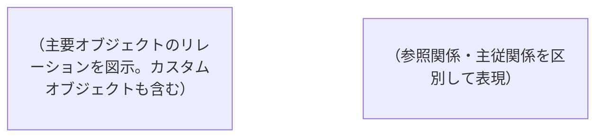

salesforce-architectエージェントとして、接続中のSalesforce組織を解析し、上流資料を作成してください。

## ユーザー入力

$ARGUMENTS

上記の入力がある場合、以下のように解釈する:
- **ファイルパス** → 該当ファイルを読み込んで分析に統合する
- **フォルダパス** → フォルダ内の全ドキュメントを読み込む
- **テキスト** → プロジェクトの補足情報（背景・目的・要件のメモ等）として扱う
- **空（引数なし）** → 組織情報のみで解析する

複数指定された場合は全て読み込む。

### ファイル形式と読み込み方法
| 形式 | 方法 |
|---|---|
| .md, .txt, .csv, .json | Read ツールで直接読み込み |
| .pdf | Read ツールで読み込み（1回20ページまで。大きいPDFはページ指定で分割読み込み） |
| .xlsx | **Python で自動変換して読み込み**（下記の変換手順を参照） |
| .docx | **Python で自動変換して読み込み**（下記の変換手順を参照） |

### Excel / Word ファイルの自動変換手順

Claude Code は .xlsx / .docx を直接読めないため、Python で中間ファイルに変換してから読み込む。

#### .xlsx（Excel）の場合
```bash
python -c "
import pandas as pd
import sys

file_path = sys.argv[1]
xl = pd.ExcelFile(file_path)

for sheet_name in xl.sheet_names:
    df = pd.read_excel(xl, sheet_name=sheet_name)
    print(f'=== シート: {sheet_name} ===')
    print(df.to_markdown(index=False))
    print()
" "<ファイルパス>"
```
→ 出力されたテキストを分析に使用する。シートが複数ある場合は全シートを処理する。

#### .docx（Word）の場合
まず `python-docx` の有無を確認する:
```bash
python -c "import docx; print('OK')" 2>/dev/null || pip install python-docx
```
```bash
python -c "
import docx
import sys

doc = docx.Document(sys.argv[1])
for para in doc.paragraphs:
    print(para.text)
for table in doc.tables:
    for row in table.rows:
        print('| ' + ' | '.join(cell.text for cell in row.cells) + ' |')
" "<ファイルパス>"
```
→ 出力されたテキストを分析に使用する。

#### フォルダ指定時の一括変換
フォルダ内に .xlsx / .docx がある場合、上記の変換を自動で全ファイルに適用する。

---

## 生成するファイル

| ファイル | パス | 内容 |
|---|---|---|
| 組織プロフィール | `docs/overview/org-profile.md` | 会社概要・業種・SF利用目的・構成サマリ |
| 要件定義書 | `docs/requirements/requirements.md` | AS-IS/TO-BE・機能要件・非機能要件・課題 |
| 変更履歴 | `docs/changelog.md` | 全コマンドの実行履歴・変更点の記録 |

---

## Phase 0: 実行モード判定

**最初に以下のファイルの存在を確認する:**
- `docs/overview/org-profile.md`
- `docs/requirements/requirements.md`

### どちらも存在しない → 初回生成モード
Phase 1 から順に実行し、新規ファイルを生成する。

### どちらか/両方存在する → 差分更新モード

**初回は組織のメタデータから情報を構築する。2回目以降は以下の3つを組み合わせて内容を充実させる:**

| ソース | 何を使うか |
|---|---|
| 組織メタデータ（再収集） | 新規追加・変更・削除の検出 |
| 既存ドキュメント | 前回の内容・手動追記を保持 |
| 現在のセッション情報 | 会話の中で確認・判明した事実・決定事項 |

**手順:**
1. 既存ファイルを全て読み込む（現在の内容を把握）
2. 現在のセッションで判明した情報を整理する（会話履歴から「要確認」が解消された事項・新たに判明した業務ルール・決定事項等）
3. Phase 1 で組織情報を再収集する
4. **3つのソースを統合**して以下を検出・反映する:
   - 新規追加されたもの（オブジェクト、項目、Apex、フロー、ユーザー等）
   - 削除されたもの
   - 変更されたもの（レコード件数の増減、APIバージョン変更等）
   - セッションで確定した事項（「推定」→「確定」への昇格）
   - 前回「要確認」だった事項で今回解消されたもの
5. 既存ファイルを更新する（既存の記述は尊重し、差分のみ反映）
6. **バージョン番号をインクリメントする**（v1.0 → v1.1 → v1.2）
7. **変更サマリを `docs/changelog.md` に追記する**

### 差分更新時の重要ルール
- **手動追記は絶対に消さない**: ヒアリング結果・確認済み事項・補足メモ等を保持する
- **要件番号（FR-XXX, NFR-XXX）は維持**: 番号の振り直しはしない。新規は続番で採番
- **「推定」→「確定」への昇格**: セッション・手動修正で確定した情報はラベルを更新する
- **バージョン番号は必ずインクリメント**: 変更がなくても「内容確認・充実」として上げる

---

## Phase 1: 組織情報の自動収集

以下のコマンドを実行して組織の全体像を把握する。
**重要: `sf` コマンドはGit Bashのパス問題を回避するため、失敗した場合は以下の形式で実行する:**
```bash
"C:/Program Files/sf/client/bin/node.exe" "C:/Program Files/sf/client/bin/run.js" <サブコマンド> <引数>
```

### 1-1. 組織基本情報
```bash
sf org display --json
```
→ 組織ID、インスタンスURL、APIバージョン、ユーザー名、組織タイプを取得

### 1-2. カスタムオブジェクト一覧
```bash
sf sobject list -s custom
```

### 1-3. 主要オブジェクトの項目構成
カスタムオブジェクトと主要標準オブジェクト（Account, Contact, Opportunity, Case, Lead）について:
```bash
sf sobject describe -s <オブジェクト名> --json
```
→ カスタム項目、リレーション、入力規則、レコードタイプを抽出

### 1-4. Apexクラス一覧
```bash
sf data query -q "SELECT Name, ApiVersion, Status, CreatedDate, LastModifiedDate FROM ApexClass WHERE NamespacePrefix = null ORDER BY LastModifiedDate DESC" --json
```

### 1-5. Apexトリガー一覧
```bash
sf data query -q "SELECT Name, TableEnumOrId, ApiVersion, Status FROM ApexTrigger WHERE NamespacePrefix = null" --json
```

### 1-6. Flow一覧
```bash
sf data query -q "SELECT ApiName, ActiveVersionId, Description, ProcessType FROM FlowDefinitionView" --json
```

### 1-7. レコード件数（主要オブジェクト）
```bash
sf data query -q "SELECT COUNT() FROM <オブジェクト名>" --json
```
→ Account, Contact, Opportunity, Case, Lead, 各カスタムオブジェクト

### 1-8. 有効ユーザー数・ライセンス情報
```bash
sf data query -q "SELECT COUNT() FROM User WHERE IsActive = true" --json
sf data query -q "SELECT Profile.Name, COUNT(Id) cnt FROM User WHERE IsActive = true GROUP BY Profile.Name ORDER BY COUNT(Id) DESC" --json
```

### 1-9. プロファイル・権限セット
```bash
sf data query -q "SELECT Name FROM Profile WHERE UserType = 'Standard'" --json
sf data query -q "SELECT Name, Label, Description FROM PermissionSet WHERE IsCustom = true AND NamespacePrefix = null" --json
```

### 1-10. カスタム設定・カスタムメタデータ
```bash
sf data query -q "SELECT QualifiedApiName, DeveloperName FROM CustomObject WHERE QualifiedApiName LIKE '%__mdt'" --json
```

### 1-11. レコードタイプ一覧
```bash
sf data query -q "SELECT SobjectType, Name, DeveloperName, IsActive, Description FROM RecordType ORDER BY SobjectType" --json
```
→ レコードタイプは業務プロセスの分岐を表す。業種・事業内容の推定精度が大きく向上する

### 1-12. Named Credential（外部連携）
```bash
sf data query -q "SELECT DeveloperName, Endpoint FROM NamedCredential" --json
```
→ エラーが出ても続行（権限不足の場合がある）

### 1-13. 接続アプリケーション（外部連携の兆候）
```bash
sf data query -q "SELECT Name, Description FROM ConnectedApplication" --json
```
→ エラーが出ても続行（権限不足の場合がある）

### 1-14. 入力規則の一覧
```bash
sf data query -q "SELECT EntityDefinition.QualifiedApiName, ValidationName, Active, Description, ErrorMessage FROM ValidationRule WHERE Active = true" --json
```
→ エラーが出ても続行。入力規則はビジネスルールの宝庫

---

## Phase 2: 既存資料の読み込み

以下のフォルダに既存資料があるか確認する:
- `docs/overview/` — 組織概要・会社情報
- `docs/requirements/` — 要件定義書・企画書・ヒアリングメモ
- `docs/design/` — 設計書
- `docs/catalog/` — オブジェクト・項目定義書（sf-catalogで生成）
- `docs/` 直下 — その他ドキュメント

ファイルがあれば全て読み込み、内容を分析に統合する。
`docs/catalog/` の定義書が揃っている場合、用語集・データモデルの精度が大幅に向上する。

**初回生成モード**でファイルがない場合は、ユーザーに聞く:
```
プロジェクトの企画書・要件書・ヒアリングメモなどはありますか？
  - ファイルパスを指定してください（複数可）
  - なければ「なし」と入力してください（組織情報のみで解析します）
```

**差分更新モード**では質問せず、既存ファイル + 組織情報で更新する。

---

## Phase 3: 組織プロフィールの生成/更新

収集した情報をもとに `docs/overview/org-profile.md` を生成（または更新）する。

### テンプレート

```markdown
# 組織プロフィール

**生成日**: YYYY-MM-DD
**最終更新日**: YYYY-MM-DD
**組織ID**: <組織ID>
**インスタンスURL**: <URL>
**APIバージョン**: <バージョン>

---

## 会社・事業概要

| 項目 | 内容 |
|---|---|
| 推定業種 | （カスタムオブジェクト名・項目名・レコードタイプから推定。根拠も記載） |
| 推定事業内容 | （データ構成・フロー名・項目名から推定される主な事業活動） |
| Salesforce利用目的 | （SFA / サービス / マーケティング / カスタムアプリ / 複合型 — 根拠付き） |
| 利用開始時期（推定） | （最古のApexクラス・カスタムオブジェクトの作成日から推定） |

### 推定の根拠
（なぜその業種・事業内容と判断したかを箇条書きで説明。例: 「XXX__c オブジェクトが存在し、YYY項目があるため不動産業と推定」）

---

## 利用規模

| 項目 | 数値 |
|---|---|
| 有効ユーザー数 | X名 |
| プロファイル数 | X種 |
| カスタム権限セット数 | X個 |

### ユーザー分布
| プロファイル | ユーザー数 | 推定ロール |
|---|---|---|
| （プロファイル名） | X名 | （営業/管理者/サポート等） |

---

## データ構成

### オブジェクト概要
| オブジェクト | 種別 | レコード数 | カスタム項目数 | レコードタイプ数 | 業務上の役割（推定） |
|---|---|---|---|---|---|
| Account | 標準 | X | X | X | （顧客管理/取引先管理等） |

### データモデル（ER図）


### データ規模の所見
（レコード件数から読み取れる傾向。例: 「Opportunityが10万件を超えており、営業活動が活発」「Caseが少なくサポート業務は限定的」等）

---

## カスタマイズ構成

### カスタマイズ度
| カテゴリ | 数量 | 評価 |
|---|---|---|
| カスタムオブジェクト | X個 | |
| Apexクラス | X個 | |
| Apexトリガー | X個 | |
| フロー | X個 | |
| カスタムメタデータ | X個 | |
| **総合カスタマイズ度** | | **低 / 中 / 高**（判定基準も記載） |

### Apex クラス（主要なもの）
| クラス名 | APIバージョン | 最終更新日 | 推定用途 |
|---|---|---|---|
（全量ではなく、主要なもの・推定用途が明確なものを記載。全量は /sf-catalog で別途出力可能）

### フロー
| フロー名 | 種別 | 状態 | 説明 |
|---|---|---|---|
（ProcessType から種別を判定: Screen Flow / Record-Triggered / Scheduled / Autolaunched 等）

### 外部連携の兆候
（接続アプリケーション・Named Credential・カスタム設定から推定される外部システム連携）

---

## セキュリティ構成

### プロファイル一覧
| プロファイル名 | 推定用途 |
|---|---|

### カスタム権限セット
| 権限セット名 | 説明 | 推定用途 |
|---|---|---|

---

## 技術的所見

### 健全性チェック
| チェック項目 | 状態 | 詳細 |
|---|---|---|
| APIバージョンの統一性 | OK/注意/警告 | （古いバージョンのApexがあれば指摘） |
| 未使用コードの兆候 | OK/注意/警告 | （使われていない可能性のあるクラス） |
| フローの整理状態 | OK/注意/警告 | （無効フロー・重複フローの有無） |
| 自動化の複雑度 | OK/注意/警告 | （トリガー+フローの競合リスク等） |

### 改善提案
- （標準機能への置き換え候補）
- （技術的負債の解消案）
- （パフォーマンス上の懸念）

---

## ステークホルダーマップ

（プロファイル・権限セット・レコードタイプの情報から、誰がどの業務でSalesforceを使っているかを推定する）

| ユーザー区分 | 推定人数 | 主な利用機能 | 利用シナリオ（推定） |
|---|---|---|---|
| （例: 営業担当） | X名 | 商談・取引先・活動 | 日次の商談管理・活動記録 |
| （例: サポート担当） | X名 | ケース・ナレッジ | 問い合わせ対応・エスカレーション |
| （例: マネージャー） | X名 | レポート・ダッシュボード | 週次KPI確認・チーム管理 |
| （例: システム管理者） | X名 | 設定・Apex・フロー | システム設定・自動化管理 |

### 補足（要ヒアリング）
- 上記は組織のプロファイル・権限構成からの推定。実際の業務役割はヒアリングで確認が必要
- 部署構成・承認フロー・レポートラインは組織情報からは読み取れないため「要確認」

---

## 用語集（Glossary）

（組織のオブジェクト名・項目名・レコードタイプ名・ピックリスト値から、この会社で使われている業務用語とSalesforce上の対応を整理する）
（**この用語集は Claude Code が出力の文脈を合わせるために最も重要なセクションの1つ**。差分更新時にも積極的に拡充する）

| 業務用語（推定） | Salesforce上の表現 | API名 | 備考 |
|---|---|---|---|
| （例: 案件） | 商談 | Opportunity | |
| （例: 顧客） | 取引先 | Account | |
| （例: 見積） | 見積り | Quote / カスタムオブジェクト | |
| （例: 受注） | 商談フェーズ「受注」 | StageName = 'Closed Won' | |

### レコードタイプ別の業務区分
| オブジェクト | レコードタイプ | 業務上の意味（推定） |
|---|---|---|
| （例: Account） | （例: 法人顧客） | （例: B2B取引先） |
| （例: Account） | （例: 個人顧客） | （例: B2C顧客） |

### 補足
- 「推定」と記載された用語は、オブジェクト名・項目名からの推定。正式な社内用語はヒアリングで確認が必要
- ヒアリングや日常会話で新しい用語が出たら、このセクションに手動で追記する
- 差分更新時、新しいオブジェクト・レコードタイプ・ピックリスト値が追加されていたら自動で用語集に反映する
```

---

## Phase 4: 要件定義書の生成/更新

収集した情報と既存資料をもとに `docs/requirements/requirements.md` を生成（または更新）する。

### 生成ルール
- **既存資料がある場合**: 資料の内容を主軸に、組織情報で補完・裏付けする
- **既存資料がない場合**: 組織情報から逆引きで現状（AS-IS）を整理し、TO-BEは「要ヒアリング」とする
- **推測で埋めない**: 不明な点は「要確認」として明記する
- **差分更新時**: 既存の要件番号・手動修正を保持し、新規分のみ追加

### テンプレート

```markdown
# 要件定義書

**プロジェクト名**: （既存資料から / または「要記入」）
**作成日**: YYYY-MM-DD
**最終更新日**: YYYY-MM-DD
**バージョン**: v1.0

---

## プロジェクト概要

### 背景・課題
（既存資料の内容 + 組織情報から見える課題を統合して記述）
（資料がない場合は、組織の状態から推定される課題を「推定」と明記して記載）

### 目的・ゴール
（既存資料から抽出 / または「要ヒアリング」）

### スコープ
| 区分 | 内容 |
|---|---|
| 対象業務 | |
| 対象ユーザー | （プロファイル・ユーザー分布から推定） |
| 対象外 | |

---

## 現状整理（AS-IS）

### 業務フロー概要
（組織のオブジェクト構成・フロー・自動化から推定される現在の業務フロー）

```mermaid
flowchart TD
    （主要な業務フローを図示）
```

### 利用中の機能
| カテゴリ | 機能 | 利用状況 | 備考 |
|---|---|---|---|
| SFA | 商談管理 | （Opportunity件数から判定） | |
| サービス | ケース管理 | （Case件数から判定） | |
| マーケティング | リード管理 | （Lead件数から判定） | |
| カスタム | （オブジェクト名） | 利用中 | |

### 現状の課題（組織情報から読み取れるもの）
| # | 課題 | 根拠 | 影響度 |
|---|---|---|---|
| 1 | （例: APIバージョンが古いApexクラスが多い） | （具体的な数値・事実） | 高/中/低 |

---

## 要件一覧

### 機能要件
（既存資料 + 組織のカスタマイズ状況を突き合わせて整理）

| # | 要件名 | 説明 | 優先度 | 実現方式 | 現状 | 備考 |
|---|---|---|---|---|---|---|
| FR-001 | | | 高/中/低 | 標準/カスタム/Flow/Apex | 実装済/未実装/要改修 | |

### 非機能要件
| # | カテゴリ | 要件 | 詳細 | 現状の充足度 |
|---|---|---|---|---|
| NFR-001 | パフォーマンス | | | |
| NFR-002 | セキュリティ | | | |
| NFR-003 | 可用性 | | | |
| NFR-004 | 拡張性 | | | |
| NFR-005 | データ移行 | | | |

---

## ビジネスルール一覧

（入力規則・フロー・Apexトリガーから読み取れるビジネスルールを整理する）
（**このセクションは実装判断の根拠になる重要なコンテキスト**。「なぜそのルールがあるのか」はメタデータからは読み取れないため、わかる範囲で推定し、不明なものは「要確認」とする）

### 入力規則から読み取れるルール
| # | オブジェクト | ルール名 | 条件（概要） | エラーメッセージ | 業務上の意味（推定） |
|---|---|---|---|---|---|
| BR-001 | | | | | |

### 自動化から読み取れるルール
| # | 種別 | 名前 | トリガー条件 | 処理内容（概要） | 業務上の意味（推定） |
|---|---|---|---|---|---|
| BR-100 | Flow/Apex | | | | |

### 補足
- 入力規則のエラーメッセージは、業務ルールを理解する最も良い手がかり
- 「なぜこのルールが必要か」が不明な場合は「要確認」として残す。ヒアリングで判明したら手動で追記する
- BR番号は通し番号。BR-001〜BR-099 は入力規則由来、BR-100〜 は自動化由来

---

## あるべき姿（TO-BE）

### 目標状態
（既存資料の内容 / または「要ヒアリング」）

### AS-IS → TO-BE ギャップ
| # | 領域 | 現状（AS-IS） | 目標（TO-BE） | ギャップ | 対応方針 |
|---|---|---|---|---|---|
| 1 | | | | | 標準機能/カスタム開発/設定変更 |

---

## 未解決事項・確認事項

| # | 質問・課題 | 背景 | 担当 | 期限 | 回答 |
|---|---|---|---|---|---|
| OI-001 | | （なぜこの確認が必要か） | | | |

---

## 前提条件・制約

| # | 区分 | 内容 |
|---|---|---|
| 1 | 前提条件 | |
| 2 | 技術的制約 | （ガバナ制限・ライセンス等） |
| 3 | 業務的制約 | |
| 4 | スケジュール制約 | |

---

## 次のステップ

- [ ] 本資料のレビュー・フィードバック
- [ ] 未解決事項の確認・回答
- [ ] 機能別設計書の作成（`/sf-design` コマンド）
- [ ] オブジェクト・項目定義書の作成（`/sf-catalog` コマンド）
```

---

## Phase 5: CLAUDE.md の自動更新

ルートの `CLAUDE.md` を読み込み、解析結果をもとに以下のセクションを更新する。
**手動で記入済みの内容は絶対に上書きしない。空欄・プレースホルダーのみ埋める。**

### 更新対象セクション

**Salesforce組織情報（org alias）**
- `sf org display` で取得した実際のエイリアスと接続先URLを反映する
- プレースホルダー（`project-dev` / `project-prod` 等）が残っていれば実値に置き換える

**主要カスタムオブジェクト（セクションがなければ追加）**
```markdown
## 主要カスタムオブジェクト

| オブジェクト名 | API名 | 用途（推定） |
|---|---|---|
| （検出されたカスタムオブジェクトを列挙。件数が多い場合は上位10件） |
```

**命名規則（検出できた場合のみ）**
- Apexクラス名・カスタムオブジェクト名から共通プレフィックスを検出した場合、`PREFIX_` 等を反映する
- 確信がない場合は「推定:」と付記して記載する

**注意事項・地雷（セクションがなければ追加しない）**
- 技術的所見で検出した問題（古いAPIバージョン・未整理フロー等）があれば追記候補として提示し、ユーザーに確認してから追記する

---

## Phase 6: 変更履歴の記録

`docs/changelog.md` に実行結果を追記する。ファイルが存在しない場合は新規作成する。

### changelog.md のフォーマット

```markdown
# 変更履歴

このファイルは `/sf-analyze`, `/sf-design`, `/sf-catalog`, `/sf-data` 等のコマンドによる自動更新を記録する。
手動での追記も可能。

---

## YYYY-MM-DD /sf-analyze（初回生成 or 差分更新）

**実行者**: （ユーザー名 — sf org display から取得）
**更新ファイル**: org-profile.md, requirements.md

### 変更サマリ
- （主な変更点を箇条書き）

### 詳細
| カテゴリ | 変更内容 |
|---|---|
| オブジェクト | （新規追加/削除されたオブジェクト） |
| 項目 | （新規追加/変更された主要カスタム項目） |
| Apex | （新規/変更/削除されたクラス・トリガー） |
| フロー | （新規/変更/削除されたフロー） |
| レコード数 | （大きな増減があったオブジェクト） |
| ユーザー | （ユーザー数の変化） |
| 要件 | （追加/変更された要件） |
```

---

## Phase 7: 報告

### 初回生成モードの場合

```
## 生成ファイル
- `docs/overview/org-profile.md` — 組織プロフィール（新規作成）
- `docs/requirements/requirements.md` — 要件定義書（新規作成）
- `docs/changelog.md` — 変更履歴（新規作成）

## 主な発見
- （業種・利用目的の推定結果）
- （特筆すべきカスタマイズや課題）
- （要確認事項のハイライト）

## 次のアクション
- 資料のレビュー・「推定」「要確認」箇所の修正
- 未解決事項への回答
- 必要に応じて `/sf-design` で機能別設計書を作成
- 必要に応じて `/sf-catalog` でオブジェクト・項目定義書を作成
```

### 差分更新モードの場合

```
## 更新ファイル
- `docs/overview/org-profile.md` — 組織プロフィール（更新）
- `docs/requirements/requirements.md` — 要件定義書（vX.X → vX.X）
- `docs/changelog.md` — 変更履歴（追記）

## 今回の主な変更点
- （差分のハイライト — 新規オブジェクト、レコード数の大きな変動、新規Apex等）
- （前回から解消された「要確認」事項）

## 注意が必要な変更
- （予期しない変更 — 削除されたオブジェクト、大幅なレコード減少等）
```

追加で深掘りしたい箇所があるか確認する。
