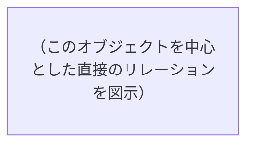

salesforce-architectエージェントとして、組織のオブジェクト・項目構成を収集し、定義書を作成してください。

## ユーザー入力

$ARGUMENTS

上記の入力がある場合、以下のように解釈する:
- **オブジェクト名**（Account, Opportunity, XXX__c 等）→ 指定オブジェクトの定義書を作成する
- **「全て」「all」** → 主要標準オブジェクト + 全カスタムオブジェクトの定義書を一括作成
- **ファイルパス** → 既存の項目定義書を読み込んで統合・標準化する
- **フォルダパス** → フォルダ内の定義書を一括読み込み
- **空（引数なし）** → オブジェクト一覧を表示し、対象を選択してもらう

複数指定された場合は全て処理する。

### ファイル形式と読み込み方法
| 形式 | 方法 |
|---|---|
| .md, .txt, .csv, .json | Read ツールで直接読み込み |
| .pdf | Read ツールで読み込み（1回20ページまで） |
| .xlsx | **Python で自動変換して読み込み**（下記の変換手順を参照） |
| .docx | **Python で自動変換して読み込み**（下記の変換手順を参照） |

### Excel / Word ファイルの自動変換手順

#### .xlsx（Excel）の場合
```bash
python -c "
import pandas as pd
import sys

file_path = sys.argv[1]
xl = pd.ExcelFile(file_path)

for sheet_name in xl.sheet_names:
    df = pd.read_excel(xl, sheet_name=sheet_name)
    print(f'=== シート: {sheet_name} ===')
    print(df.to_markdown(index=False))
    print()
" "<ファイルパス>"
```

#### .docx（Word）の場合
```bash
python -c "import docx; print('OK')" 2>/dev/null || pip install python-docx
```
```bash
python -c "
import docx
import sys

doc = docx.Document(sys.argv[1])
for para in doc.paragraphs:
    print(para.text)
for table in doc.tables:
    for row in table.rows:
        print('| ' + ' | '.join(cell.text for cell in row.cells) + ' |')
" "<ファイルパス>"
```

---

## 生成するファイル

```
docs/catalog/
├── _index.md                           # 全オブジェクトのインデックス（自動生成）
├── _data-model.md                      # 全体ER図・リレーション一覧
├── standard/                           # 標準オブジェクト
│   ├── Account.md
│   ├── Contact.md
│   ├── Opportunity.md
│   ├── Case.md
│   └── Lead.md
└── custom/                             # カスタムオブジェクト
    ├── XXX__c.md
    └── YYY__c.md
```

---

## Phase 0: コンテキスト読み込み

### 必須コンテキスト
| ファイル | パス | 用途 |
|---|---|---|
| 組織プロフィール | `docs/overview/org-profile.md` | 用語集・データモデル・カスタマイズ構成 |
| 要件定義書 | `docs/requirements/requirements.md` | ビジネスルール（BR-XXX）との紐づけ |

→ 存在しない場合は警告するが続行可能（組織メタデータのみで生成）

### 既存カタログ
- `docs/catalog/` 配下の全ファイルを読み込む
- 既存の定義書がある場合は差分更新モードに切り替え

---

## Phase 1: 実行モード判定

### モード A: オブジェクト一覧の表示（引数なし）

```bash
sf sobject list -s custom
```

一覧を表示して選択してもらう:
```
## オブジェクト一覧

### 標準オブジェクト（主要）
| # | オブジェクト | 定義書 | 状態 |
|---|---|---|---|
| 1 | Account | docs/catalog/standard/Account.md | 未作成 |
| 2 | Contact | docs/catalog/standard/Contact.md | 作成済み（v1.0） |
| 3 | Opportunity | — | 未作成 |
| 4 | Case | — | 未作成 |
| 5 | Lead | — | 未作成 |

### カスタムオブジェクト
| # | オブジェクト | 定義書 | 状態 |
|---|---|---|---|
| 6 | Invoice__c | — | 未作成 |
| 7 | Project__c | — | 未作成 |

対象を入力してください（番号 / オブジェクト名 / 複数可 / 「全て」）
```

### モード B: 指定オブジェクトの定義書作成

指定されたオブジェクトの定義書を生成する。

### モード C: 一括作成（「全て」「all」指定）

主要標準オブジェクト（Account, Contact, Opportunity, Case, Lead）+ 全カスタムオブジェクトの定義書を一括生成する。

### モード D: 既存定義書の読み込み・統合（ファイルパス指定）

外部の項目定義書（Excel等）を読み込み、標準フォーマットに変換・統合する。

---

## Phase 2: 組織メタデータの収集

対象オブジェクトごとに以下を実行する。

**重要: `sf` コマンドはGit Bashのパス問題を回避するため、失敗した場合は以下の形式で実行する:**
```bash
"C:/Program Files/sf/client/bin/node.exe" "C:/Program Files/sf/client/bin/run.js" <サブコマンド> <引数>
```

### 2-1. オブジェクト詳細
```bash
sf sobject describe -s <オブジェクト名> --json
```
→ 以下を抽出する:
- **基本情報**: API名、表示名、キープレフィックス
- **全項目**: 項目名、API名、データ型、長さ、必須、一意、デフォルト値、ヘルプテキスト
- **カスタム項目のみフィルタ**: `custom: true` の項目を識別
- **リレーション**: lookupRelationship, masterDetail の関連先
- **レコードタイプ**: 名前、DeveloperName、アクティブ/非アクティブ
- **入力規則**: 入力規則名、数式、エラーメッセージ
- **ピックリスト値**: 各ピックリスト項目の選択肢一覧

### 2-2. レコード件数
```bash
sf data query -q "SELECT COUNT() FROM <オブジェクト名>" --json
```

### 2-3. 項目の利用状況（可能であれば）
```bash
sf data query -q "SELECT COUNT(<項目API名>) FROM <オブジェクト名> WHERE <項目API名> != null" --json
```
→ 主要なカスタム項目について、値が入っているレコード数を確認。項目が実際に使われているかの指標になる。
→ 項目数が多い場合は全項目ではなく主要なカスタム項目に絞る。

---

## Phase 3: オブジェクト定義書の生成

### テンプレート

```markdown
# [表示名] オブジェクト定義書

**API名**: <API名>
**種別**: 標準 / カスタム
**作成日**: YYYY-MM-DD
**最終更新日**: YYYY-MM-DD
**バージョン**: v1.0

---

## 基本情報

| 項目 | 内容 |
|---|---|
| 表示名 | |
| API名 | |
| 表示名（複数形） | |
| キープレフィックス | |
| レコード数 | X件 |
| 業務上の役割 | （org-profile.md の用語集・データ構成から引用。推定の場合は明記） |

---

## リレーション

### 親オブジェクト（このオブジェクトが参照している先）
| リレーション種別 | 関連オブジェクト | 項目API名 | 必須 | 説明 |
|---|---|---|---|---|
| 主従関係 | | | | |
| 参照関係 | | | | |

### 子オブジェクト（このオブジェクトを参照しているもの）
| リレーション種別 | 関連オブジェクト | 項目API名 | 説明 |
|---|---|---|---|

### ER図（このオブジェクト中心）


---

## レコードタイプ

| レコードタイプ名 | DeveloperName | アクティブ | 業務上の意味（推定） |
|---|---|---|---|
| | | Yes/No | |

---

## 項目一覧

### 標準項目（主要なもの）
| # | 表示名 | API名 | データ型 | 必須 | 説明 |
|---|---|---|---|---|---|
（Name, OwnerId, CreatedDate 等の標準項目は主要なものだけ記載。全量は不要）

### カスタム項目
| # | 表示名 | API名 | データ型 | 長さ | 必須 | 一意 | デフォルト値 | 利用率 | 説明 |
|---|---|---|---|---|---|---|---|---|---|
| 1 | | | Text/Number/Picklist/... | | Yes/No | Yes/No | | X% | |

（利用率 = 値が入っているレコードの割合。取得できた場合のみ記載）

### ピックリスト項目の値一覧
| 項目名 | API名 | 値 | デフォルト | アクティブ |
|---|---|---|---|---|
| | | 値1 / 値2 / 値3 ... | | Yes/No |

### 数式項目
| 項目名 | API名 | 戻り型 | 数式 | 説明 |
|---|---|---|---|---|
| | | | | |

---

## 入力規則

| # | ルール名 | アクティブ | 条件（概要） | エラーメッセージ | 関連BR |
|---|---|---|---|---|---|
| 1 | | Yes/No | | | BR-XXX（紐づく場合） |

---

## 自動化

| # | 種別 | 名前 | トリガー | 概要 | 関連設計書 |
|---|---|---|---|---|---|
| 1 | Apexトリガー | | before/after insert/update/delete | | docs/design/apex/... |
| 2 | フロー | | Record-Triggered | | docs/design/flow/... |
| 3 | ワークフロー | | （レガシー） | | |

---

## 権限マトリクス

| プロファイル/権限セット | 参照 | 作成 | 編集 | 削除 | 備考 |
|---|---|---|---|---|---|
| （ステークホルダーマップの区分を使用） | | | | | |

### 項目レベルセキュリティ（主要カスタム項目）
| 項目 | プロファイルA | プロファイルB | プロファイルC |
|---|---|---|---|
| | 参照+編集 / 参照のみ / 非表示 | | |

（全項目×全プロファイルは膨大になるため、主要なカスタム項目と主要プロファイルに絞る。
 全量が必要な場合は別途 Excel 出力を検討）

---

## 所見・注意点

- （この定義書を見て気づいた点。例: 「利用率0%の項目が多い」「レガシーワークフローが残っている」等）
- （設計書やビジネスルールとの不整合があれば指摘）
```

---

## Phase 4: 全体データモデル図の生成

全オブジェクトの定義書を作成した後（モード C / 一括作成時）、`docs/catalog/_data-model.md` を生成する。

```markdown
# データモデル全体図

**最終更新日**: YYYY-MM-DD

---

## 全体ER図

```mermaid
erDiagram
    （全オブジェクトのリレーションを1つの図に集約）
    （主従関係は ||--o{ 、参照関係は }o--o{ で表現）
    （カスタムオブジェクトも含む）
```

## リレーション一覧

| 親オブジェクト | 子オブジェクト | 種別 | 項目API名 | 説明 |
|---|---|---|---|---|
| Account | Contact | 参照 | AccountId | |
| Account | Opportunity | 参照 | AccountId | |

## オブジェクト分類

### 業務データ系
（取引先、商談、ケース等 — 日常業務で使うレコード）

### マスタデータ系
（商品、価格表等 — 参照用のマスタ）

### トランザクション系
（注文明細、活動等 — 業務処理の記録）

### 設定・管理系
（カスタムメタデータ、カスタム設定等）
```

---

## Phase 5: インデックス生成

`docs/catalog/_index.md` を自動生成/更新する。

```markdown
# オブジェクト・項目定義書 インデックス

**最終更新日**: YYYY-MM-DD
**オブジェクト総数**: X件（標準: X / カスタム: X）

---

## 標準オブジェクト
| オブジェクト | API名 | レコード数 | カスタム項目数 | バージョン | 最終更新 |
|---|---|---|---|---|---|
| [取引先](standard/Account.md) | Account | X | X | v1.0 | YYYY-MM-DD |

## カスタムオブジェクト
| オブジェクト | API名 | レコード数 | カスタム項目数 | バージョン | 最終更新 |
|---|---|---|---|---|---|
| [請求書](custom/Invoice__c.md) | Invoice__c | X | X | v1.0 | YYYY-MM-DD |

## 全体資料
| 資料 | パス | 説明 |
|---|---|---|
| [データモデル全体図](_data-model.md) | データモデル全体図 | 全オブジェクトのER図・リレーション一覧 |
```

---

## Phase 6: 既存定義書の読み込み・統合（モード D）

外部の項目定義書ファイルが指定された場合:

1. ファイルを読み込む（.xlsx の場合は Python で自動変換）
2. 内容を分析し、対象オブジェクトを特定する
3. プロジェクトの標準テンプレートに変換する
4. 適切なフォルダ（standard/ or custom/）に保存する

### Excel 項目定義書でよくあるフォーマット
以下のような構成を想定して解析する:
- シート名 = オブジェクト名
- 列: 項目名、API名、データ型、桁数、必須、説明 ...
- 複数オブジェクトが1シートの場合はオブジェクト名列で分割

### 変換時のルール
- 元の資料の情報量を減らさない
- org-profile.md の用語集と照合し、用語を統一する
- 組織メタデータと突き合わせ、**差異があれば報告する**（資料と実態の乖離）
- 推定で補完した部分は「推定」と明記

### 資料と組織の差異レポート
既存定義書と組織のメタデータに差異がある場合:
```
## 定義書と組織の差異

| オブジェクト | 項目 | 定義書 | 組織の実態 | 対応 |
|---|---|---|---|---|
| Account | Status__c | 必須 | 任意 | 要確認 |
| Invoice__c | Total__c | 記載なし | 存在する | 定義書に追加 |
| Order__c | — | 記載あり | 組織に存在しない | 要確認（未デプロイ？削除済み？） |
```

---

## Phase 7: 差分更新

既存の定義書ファイルが存在する場合:

1. 既存ファイルを読み込む
2. 組織メタデータを再収集し、既存内容と比較
3. 以下の変更を検出する:
   - 新規追加された項目
   - 削除された項目
   - データ型・必須・デフォルト値が変わった項目
   - 新しいレコードタイプ・入力規則・自動化
   - レコード件数の増減
4. 手動で追記された情報（業務上の役割、説明等）は保持する
5. バージョン番号を更新する
6. _index.md と _data-model.md を更新する
7. `docs/changelog.md` に変更を記録する

---

## Phase 8: 変更履歴の記録

`docs/changelog.md` に追記する:

```markdown
## YYYY-MM-DD /sf-catalog

**対象**: <オブジェクト名>（or 一括作成 X件）
**実行者**: （ユーザー名）
**更新ファイル**: docs/catalog/...

### 変更サマリ
- （新規作成 / 項目追加 / 項目削除 / 変更内容）

### 項目変更詳細（差分更新時）
| オブジェクト | 変更種別 | 項目 | 変更内容 |
|---|---|---|---|
| Account | 追加 | NewField__c | テキスト(255) |
| Invoice__c | 変更 | Status__c | 必須 → 任意 |
```

---

## Phase 9: 報告

### 新規作成の場合
```
## 生成ファイル
- docs/catalog/{standard|custom}/<オブジェクト名>.md — X件

## 概要
- 対象オブジェクト: X個
- カスタム項目総数: X個
- リレーション数: X個

## 注目点
- （利用率が低い項目がある場合）
- （レガシー自動化が残っている場合）
- （定義書と用語集の不整合がある場合）

## 次のアクション
- 定義書の「業務上の役割」「説明」欄を手動で補完
- 権限マトリクスの確認
- 必要に応じて `/sf-design` で機能設計書を作成
```

### 既存定義書の読み込みの場合
```
## 統合ファイル
- docs/catalog/.../<オブジェクト名>.md — X件

## 定義書と組織の差異
- 差異あり: X件（詳細は各ファイル内の差異レポートを参照）
- 一致: X件

## 用語の統一
- （org-profile.md の用語集と異なる表現があった場合に報告）
```

追加で確認したいオブジェクトがあるか、定義書の内容にフィードバックがあるか確認する。
