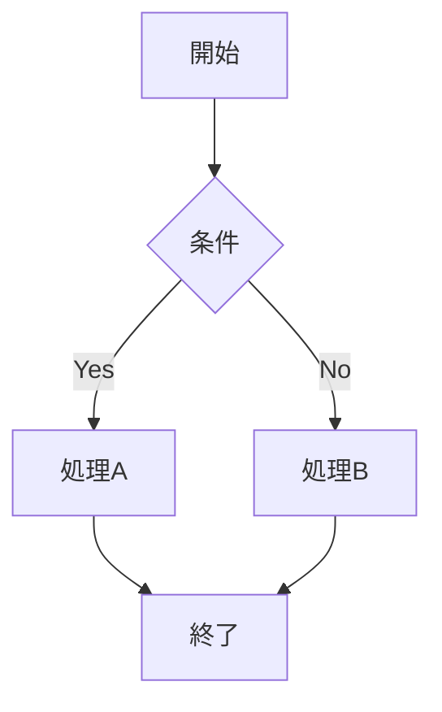

salesforce-architectエージェントとして、機能別の設計書を作成してください。

## ユーザー入力

$ARGUMENTS

上記の入力がある場合、以下のように解釈する:
- **要件番号**（FR-001, FR-002 等）→ 該当要件の設計書を作成する
- **機能名**（「商談管理」「ケース自動振り分け」等）→ 該当機能の設計書を作成する
- **ファイルパス**（.md, .xlsx, .pdf 等）→ 既存設計書を読み込んで統合・標準化する
- **フォルダパス** → フォルダ内の設計書を一括読み込み
- **空（引数なし）** → 要件定義書の全機能要件から設計書の作成計画を提示する

複数指定された場合は全て処理する。

---

## Phase 0: コンテキスト読み込み

**以下のファイルを必ず読み込んでから作業を開始する:**

### 必須コンテキスト
| ファイル | パス | 用途 |
|---|---|---|
| 組織プロフィール | `docs/overview/org-profile.md` | 業種・用語集・データモデル・ステークホルダー |
| 要件定義書 | `docs/requirements/requirements.md` | 要件一覧・ビジネスルール・AS-IS/TO-BE |

→ どちらかが存在しない場合は警告する:
```
組織プロフィール / 要件定義書が見つかりません。
先に `/sf-analyze` を実行して上流資料を作成することを推奨します。
このまま続行しますか？（組織情報なしで設計書を作成します）
```

### 既存設計書
- `docs/design/` フォルダ内の全ファイルを読み込む
- 既存設計書との重複・矛盾がないか確認する

### 組織メタデータ（必要に応じて）
設計対象の機能に関連するオブジェクト・項目の詳細情報が必要な場合:
```bash
sf sobject describe -s <オブジェクト名> --json
```

**重要: `sf` コマンドはGit Bashのパス問題を回避するため、失敗した場合は以下の形式で実行する:**
```bash
"C:/Program Files/sf/client/bin/node.exe" "C:/Program Files/sf/client/bin/run.js" <サブコマンド> <引数>
```

---

## Phase 1: 実行モード判定

### モード A: 設計計画の提示（引数なし）

要件定義書の機能要件一覧を読み、設計書の作成計画を提示する:

```
## 設計書 作成計画

要件定義書から以下の機能要件を検出しました。
設計書を作成する対象を指定してください（番号 or 機能名）。

| # | 要件 | 設計書 | 状態 |
|---|---|---|---|
| FR-001 | 商談管理機能 | docs/design/FR-001_opportunity-management.md | 未作成 |
| FR-002 | ケース自動振り分け | docs/design/FR-002_case-routing.md | 作成済み（v1.0） |
| FR-003 | 請求データ連携 | — | 未作成 |

作成する要件番号を入力してください（複数可、例: FR-001 FR-003）
全て作成する場合は「全て」と入力してください
```

### モード B: 指定機能の設計書作成（要件番号 or 機能名指定）

指定された機能の設計書を生成する。

### モード C: 既存設計書の読み込み・統合（ファイルパス指定）

外部の設計書を読み込み、プロジェクトの標準フォーマットに変換・統合する。

---

## Phase 2: 設計書の生成

### ファイル命名規則
```
docs/design/{要件番号}_{機能名-kebab-case}.md
```
例:
- `docs/design/FR-001_opportunity-management.md`
- `docs/design/FR-002_case-routing.md`
- `docs/design/FR-010_invoice-integration.md`

要件番号がない場合（要件定義書に紐づかない設計）:
- `docs/design/MISC-001_{機能名}.md`

### テンプレート

```markdown
# [機能名] 機能設計書

**要件番号**: FR-XXX
**作成日**: YYYY-MM-DD
**最終更新日**: YYYY-MM-DD
**バージョン**: v1.0
**ステータス**: ドラフト / レビュー中 / 承認済み

---

## 概要

### 目的
（この機能が解決する課題。要件定義書の該当要件から引用・要約）

### スコープ
| 区分 | 内容 |
|---|---|
| 対象 | |
| 対象外 | |

### ユーザーストーリー
- As a [ロール（ステークホルダーマップから）], I want [目標], so that [価値]

### 関連要件
| 要件番号 | 要件名 | 関係 |
|---|---|---|
| FR-XXX | | 主要件 |
| BR-XXX | | 関連ビジネスルール |
| NFR-XXX | | 関連非機能要件 |

---

## 実現方式

### 方式選定
| 選択肢 | 方式 | メリット | デメリット | 判定 |
|---|---|---|---|---|
| A | 標準機能 | | | |
| B | Flow | | | |
| C | Apex | | | |

**選定結果**: （選択した方式と理由）

### 使用するSalesforce機能
| 機能 | 用途 |
|---|---|
| （例: Record-Triggered Flow） | （例: 商談クローズ時の自動処理） |
| （例: LWC） | （例: カスタム入力画面） |

---

## データ設計

### 対象オブジェクト
（org-profile.md の用語集を参照して、社内用語 ↔ Salesforce表現を併記する）

| オブジェクト | API名 | 役割 | 新規/既存 |
|---|---|---|---|
| | | | |

### 項目設計（新規・変更のみ）
| オブジェクト | 項目名 | API名 | データ型 | 必須 | デフォルト値 | 説明 |
|---|---|---|---|---|---|---|
| | | | | | | |

### リレーション


---

## 業務フロー

### 正常系フロー


### 異常系・例外フロー
| # | 例外条件 | 処理 | ユーザーへの通知 |
|---|---|---|---|
| 1 | | | |

---

## 画面設計（画面がある場合）

### 画面一覧
| # | 画面名 | 種別 | URL/パス | 対象ユーザー |
|---|---|---|---|---|
| 1 | | Lightning Page / Screen Flow / LWC | | |

### 画面レイアウト
（各画面の構成要素を記述。必要に応じてASCIIアートやMermaidで表現）

| セクション | 要素 | 種別 | 動作 |
|---|---|---|---|
| | | テキスト入力 / ピックリスト / ボタン等 | |

---

## ロジック設計

### 処理フロー（Flow の場合）
```mermaid
flowchart TD
    （フローの詳細処理ステップ）
```

### 処理仕様（Apex の場合）
| クラス名 | メソッド | 入力 | 出力 | 処理概要 |
|---|---|---|---|---|
| | | | | |

### バリデーション
| # | 項目/条件 | ルール | エラーメッセージ | 関連BR |
|---|---|---|---|---|
| 1 | | | | BR-XXX |

### 自動化ロジック
| # | トリガー | 条件 | アクション | 備考 |
|---|---|---|---|---|
| 1 | （レコード作成時等） | | | |

---

## 権限設計

| プロファイル/権限セット | オブジェクト | CRUD | 項目レベル | 備考 |
|---|---|---|---|---|
| （ステークホルダーマップの区分を使用） | | C/R/U/D | 参照/編集 | |

---

## 外部連携（該当する場合）

### 連携概要
| 連携先 | 方式 | 方向 | 頻度 | 認証方式 |
|---|---|---|---|---|
| | REST API / Platform Event / Batch | 送信/受信/双方向 | リアルタイム/バッチ | Named Credential等 |

### データマッピング
| 送信元 | 送信元項目 | 送信先 | 送信先項目 | 変換ルール |
|---|---|---|---|---|
| | | | | |

---

## テスト観点

### テストシナリオ
| # | シナリオ | 期待結果 | テスト種別 |
|---|---|---|---|
| 1 | （正常系） | | 単体/結合/E2E |
| 2 | （異常系） | | |
| 3 | （境界値） | | |

### Apexテスト（Apexがある場合）
| テストクラス | テストメソッド | テスト対象 | アサーション |
|---|---|---|---|
| | | | |

---

## ガバナ制限への配慮

| 制限 | 上限 | この機能での見積 | リスク | 対策 |
|---|---|---|---|---|
| SOQL クエリ数 | 100/トランザクション | | 低/中/高 | |
| DML 操作数 | 150/トランザクション | | | |
| CPU時間 | 10,000ms | | | |
| ヒープサイズ | 6MB / 12MB(非同期) | | | |

---

## 影響範囲

### 既存機能への影響
| 影響を受ける機能/設定 | 影響内容 | 対応方針 |
|---|---|---|
| | | |

### デプロイ時の注意
- （デプロイ順序の制約）
- （データ移行の必要性）
- （ユーザーへの事前通知）

---

## 未解決事項

| # | 質問・課題 | 背景 | 担当 | 期限 | 回答 |
|---|---|---|---|---|---|
| DI-001 | | | | | |

---

## 受入基準

- [ ] （Given / When / Then 形式で記述）
- [ ] （例: Given 商談のフェーズが「提案」の場合, When 金額を0円に変更すると, Then エラーメッセージが表示される）
```

---

## Phase 3: 既存設計書の読み込み・統合（モード C）

外部の設計書ファイルが指定された場合:

1. ファイルを読み込む
2. 内容を分析し、対応する要件番号を特定（または新規採番）
3. プロジェクトの標準テンプレートに変換する
4. 元の資料にあった情報で、テンプレートに該当セクションがない場合は「補足情報」セクションとして末尾に追加
5. `docs/design/` に保存する

### 変換時のルール
- 元の資料の情報量を減らさない（テンプレートに収まらない情報は補足として残す）
- 用語は org-profile.md の用語集に合わせる
- 推定で補完した部分は「推定」と明記する

---

## Phase 4: 差分更新

既存の設計書ファイルが存在する場合:

1. 既存ファイルを読み込む
2. 組織メタデータの変更を検出（オブジェクト・項目の追加/変更/削除）
3. 要件定義書の変更を検出（要件の追加/変更）
4. 手動で修正された内容は保持する
5. バージョン番号を更新する
6. `docs/changelog.md` に変更を記録する

---

## Phase 5: 変更履歴の記録

`docs/changelog.md` に追記する:

```markdown
## YYYY-MM-DD /sf-design

**対象**: FR-XXX [機能名]
**実行者**: （ユーザー名）
**更新ファイル**: docs/design/FR-XXX_xxx.md

### 変更サマリ
- （新規作成 or 更新内容）
```

---

## Phase 6: 報告

### 新規作成の場合
```
## 生成ファイル
- `docs/design/FR-XXX_xxx.md` — [機能名] 設計書（v1.0）

## 設計のポイント
- 実現方式: （選定した方式と理由）
- 対象オブジェクト: （主要なもの）
- ガバナ制限リスク: （あれば）

## 要確認事項
- （DI-XXX の未解決事項ハイライト）

## 次のアクション
- 設計書のレビュー
- 未解決事項の確認
- 必要に応じて `/sf-catalog` でオブジェクト・項目定義書を作成
```

### 既存設計書の読み込みの場合
```
## 統合ファイル
- `docs/design/FR-XXX_xxx.md` — [機能名]（外部資料から統合）

## 統合内容
- 元ファイル: （パス）
- 標準テンプレートへの変換完了
- 追加の補足情報: X件

## 用語の統一
- （org-profile.md の用語集と異なる表現があった場合に報告）
```

追加で設計したい機能があるか、設計書の内容にフィードバックがあるか確認する。
