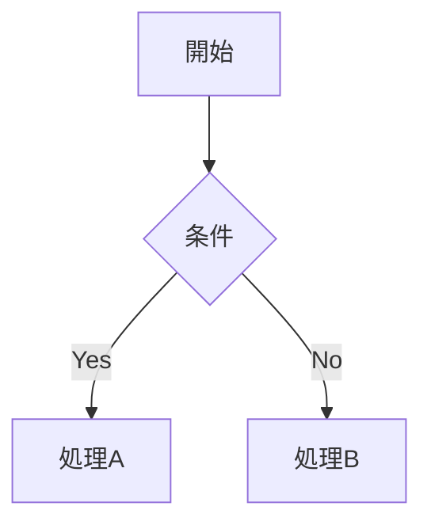

# [機能名] 機能設計書

**作成日**: YYYY-MM-DD | **バージョン**: v1.0 | **作成者**:

## 概要
（目的・背景・解決する課題を3行以内で）

## スコープ
- **対象**: 
- **対象外**: 

## ユーザーストーリー
- As a [ロール], I want [目標], so that [価値]

## 業務フロー

## 詳細仕様

### 画面・UI
| 要素 | 種別 | 動作 |
|---|---|---|

### バリデーション
| 項目 | 条件 | エラーメッセージ |
|---|---|---|

### 自動化ロジック
（フロー/Apexの処理内容を記述）

## 受入基準
- [ ]
- [ ]

## 制約・前提条件

## 未解決事項（要確認）
| # | 質問・課題 | 担当 | 期限 | 回答 |
|---|---|---|---|---|
