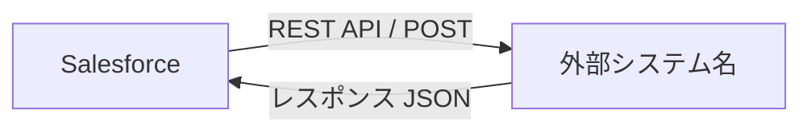

# [連携名] 外部システム連携設計書

**作成日**: YYYY-MM-DD | **バージョン**: v1.0 | **関連要件**: FR-XXX

## 概要
（何のために、どのシステムと、何を連携するかを3行以内で）

## システム構成図

## 連携仕様

| 項目 | 内容 |
|---|---|
| 連携方向 | Salesforce → 外部 / 外部 → Salesforce / 双方向 |
| 連携方式 | REST / SOAP / Platform Events / Outbound Messages |
| 認証方式 | OAuth2.0 / API Key / Basic / mTLS |
| エンドポイント | Named Credentials名: `callout:XXX` |
| タイムアウト | 秒 |
| 呼び出しタイミング | トリガー保存後 / 定期バッチ / ユーザー操作 |

## データマッピング

### リクエスト（Salesforce → 外部）
| Salesforce項目 | API項目名 | 型 | 必須 | 備考 |
|---|---|---|---|---|
| | | | | |

### レスポンス（外部 → Salesforce）
| API項目名 | Salesforce項目 | 型 | 備考 |
|---|---|---|---|
| | | | |

## エラーハンドリング

| エラー種別 | 対処方法 | 通知先 |
|---|---|---|
| タイムアウト | リトライ（最大X回） | |
| 4xx（リクエストエラー） | エラーログ記録・処理中断 | |
| 5xx（サーバーエラー） | リトライ後、失敗通知 | |
| ネットワーク障害 | Queueableでリトライ | |

## 非機能要件

| 項目 | 要件 |
|---|---|
| 想定コール頻度 | 件/日 |
| ガバナ制限リスク | コールアウト100回/トランザクション制限への対応 |
| Sandbox対応 | 本番・Sandbox別エンドポイント（カスタムメタデータで管理） |

## テスト方針

- `HttpCalloutMock` を実装してユニットテストを作成
- Sandbox環境での結合テスト手順
- 異常系（タイムアウト・エラーレスポンス）のテストケース

## 未解決事項（要確認）
| # | 質問 | 担当 | 期限 |
|---|---|---|---|
| 1 | | | |
